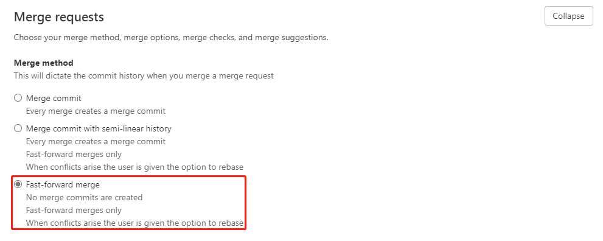
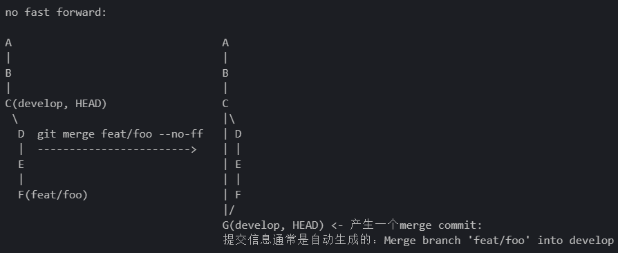
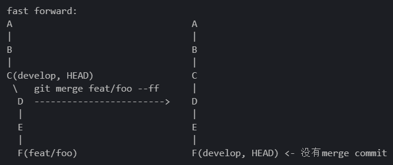
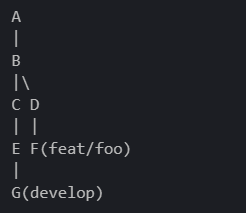
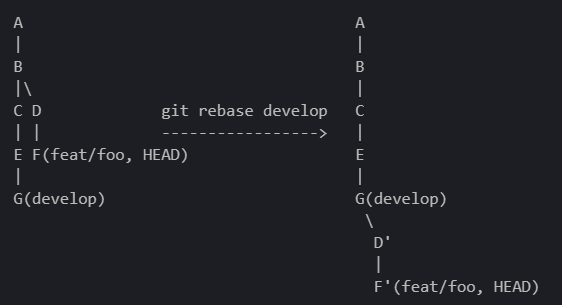
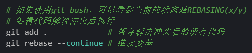
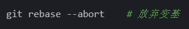
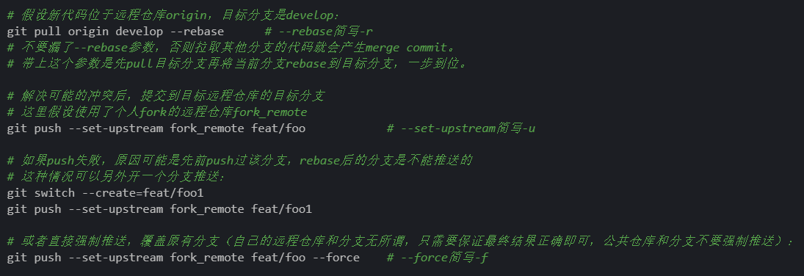

# Gitlab fast forward merge 新实践

# 

## 背景与相关知识

中山项目现场赶需求，各种紧急需求当 bug 修复，导致分支混乱，甚至还出现了丢代码的情况

### fast forward merge

fast forward merge 是 git 的一种不产生 merge commit 的合并策略，可以使 git 的提交记录图更加清晰，变成一条直线

（注：gitlab merge request 默认合并后删除分支，因此合并后 feat/too 图里略了）

no fast forward:（默认）

# 

fast forward:

# 

从结果上来看，这种合并方式就像是一个磁带机的磁头（develop 分支的头指针）从 C 点直接向前移动到了 F 点，就像磁带机的快进操作一样，因此称作快进合并（fast forward merge）。

那么如果我们的磁带像下图一样"分叉"了该怎么快进呢？这个时候就需要后文介绍的 rebase 操作了。

# 

### rebase

rebase 中文译名为变基，顾名思义，是让一个分支的"根基"发生改变。

如果我们当前在`feat/foo`分支（HEAD 为 feat/foo），则执行`git rebase develop`会变成这样：

# 

从结果上来看，rebase 操作就像是把当前分支（feat/foo）从他和目标分支（develop）分叉的地方剪下来，然后再接到目标分支（develop）上。

需要注意的是变基以后 D 和 F 变成了 D'和 F'。他们和原来的 commit hash 并不相同，是新的结点。如果没有其他的分支追踪原来的 D 和 F 结点，那么原来的 D 和 F 将成为游离的提交，并会被`git gc`回收。不过不用担心，除了 commit hash 以外，修改内容、提交信息、提交时间等在 rebase 操作前后默认都会保持不变。

不幸的是，rebase 也和 merge 一样，可能会产生冲突导致不能自动完成变基。这个时候就需要手动解决冲突。和 merge 解决冲突不同的是，rebase 需要你为**每一个存在冲突的 commit**解决冲突，而不像 merge 那样是一次性解决所有冲突。

解决冲突的操作（由于 rebase 一次可能会有多个 commit 存在冲突，以下操作可能需要进行多次）：

# 

如果你发现 rebase 过程中需要解决的冲突有点太多了，没关系，也可以放弃变基，恢复到 rebase 前的状态。（但如果变基成功执行到底后，想回去就只能通过 reflog 回溯历史了）

# 

完成变基操作以后，提交就又变成在同一条线上了，就可以愉快地快进合并了！

## 项目实践

前置条件： gitlab 开启 fast forward merge（目前 EMR 前端项目已开启）

1. 本地开发，产生若干 commit

2\. 提交代码发起 Merge Request 之前，尽量先拉取目标分支的代码并 rebase，解决冲突后再推送：

# 

3\. 发起 Merge Request。如果在合并之前的 code review 出现了需要改进的地方，进行修改并提交新的 commit。

4\. 如果在 code review 通过之前被其他开发者的 Merge Request 抢先合并了，需要在 gitlab 上点一下 rebase。自动 rebase 失败则需要本地 rebase 解决再强制推送（可能有不需要强制推送的办法，但应该会产生 merge commit）

## rebase 进阶操作

实际上，rebase 支持指定每一个 commit 如何处理，详细可参考[这里:git rebase -i](https://git-scm.com/docs/git-rebase#Documentation/git-rebase.txt--i)（可以做到将多个 commit 在 rebase 后合并成一个 commit）

## 附录

推荐几个 vscode 的 git 插件： `mhutchie.git-graph eamodio.gitlens`
