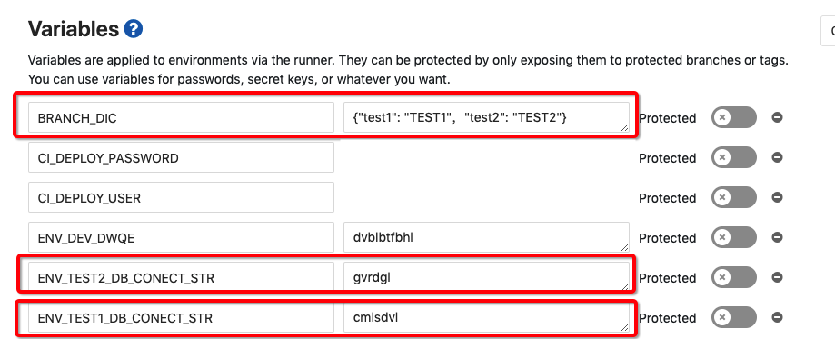

> 掌握公司 DevOps 流程的实战可以参考视频：[https://ww58d668fc292f65d4.study.moxueyuan.com/course/569118](https://ww58d668fc292f65d4.study.moxueyuan.com/course/569118)
>
> 最新的一些 Gitlab CI 使用技巧（查看日志，在线上 K8S 容器内使用命令行、更好的环境变量配置方案），可以查看博客： 《Gitlab 实用新特性推介》[http://platform-public.git.page.sy/team/blogs/gitlab-new-features/](http://platform-public.git.page.sy/team/blogs/gitlab-new-features/)

为了规范项目开发模式，我们规定了公司项目统一的分支策略与分支命名规范。公司 DevOps 工具平台将基于该分支策略进行 CI/CD 的技术支持（如 Gitlab CI 模板）。

各个研发团队**必须**遵循该规范的基本原则，但可以基于自己项目的实际需求对项目分支策略进行一定程度的扩展，并寻求架构组 & DevOps 工作组的支持。

# 1.项目分支策略与规范

## 主要分支

- **master**: 项目主版本分支，原则上，所有项目主版本都应发布在该分支上。一般地，在 test 分支上测试完毕的代码将会合并到 master 上，我们默认选择该分支进行最后的打包交付。
- **develop**: 开发分支，项目开发者将会在该分支进行日常开发。开发需要提测时，将 develop 分支的代码合并到 test 分支上，供测试团队进行测试。
- **test**：测试分支，测试团队用于进行服务测试的分支。
- **staging**： 预发布分支，在 test 代码正式合并到 master 之前，可以先合并到 staging 进行更长周期的系统测试，修复过程中碰到的问题。在公司内环境中，staging 分支也用于团队外的项目演示。

上述分支我们配置的 Gitlab CI 将会在 K8S 默认创建对应的线上应用环境，并且在分支代码更新时自动运行 CI 进行环境更新。

除了上述主要分支，我们还可以创建辅助分支用于日常开发工作。

## 辅助分支

- **feature**: 当开发者需要开发一个工期较长的特定功能，同时在这期间保证 develop 分支不受影响。开发者可以从 develop 分支衍生出 feature 分支进行特定功能特性的开发，其命名格式为 feature/特性名。当特性分支开发完毕后，开发者将该分支合并回 develop 中。

- **hotfix**：特定版本主发布分支 master 出现需要紧急修复的错误，而 develop / test 分支上已经有后续版本功能的代码时，可以在 master 分支上衍生出 hotfix 分支进行问题的紧急修复，修复完毕后 hotfix 分支上的代码变更将会同时合到 master 与 develop 上，保证问题的解决。

- **release**: 发布版本分支，与 staging 功能类似，代表预发布版本 （release candidate， rc）。同时在有多现场的项目定制化场景时可以代表所在项目现场的分支（命名格式为 release/现场名），用于迭代开发一些不应归于主版本的，项目定制化需求。该类分支视情况进行合并或保留。

分支名不要使用中文，也不能带#号，会影响 CI 过程。建议只使用小写字母、数字和连接符，即\[a-z0-9-\]，因为分支自动创建的对应 repository 只包含这三种。

分支名不要超过 10 个字符，因为转化为 k8s 上资源名称时最长只使用前 10 个字符，虽然有随机后缀的因素资源不会重名，但如果前 10 个字符相同会没有区分度。

## 基本开发分支策略

基于上述分支，我们可以规定一套基本的标准分支策略与开发流程：


如图所示，研发同学主要在 develop 分支上开发，如果有需要开发一个特定功能，可以在 develop 上分出一个 feature 分支（命名格式 "feaure/特性名"）

当开发完毕需要提测时，测试同学将 develop 分支合并到 test 进行测试，如果有问题就在 develop 分支修复并由测试同学持续合并到 test 分支，直到问题修复可以发版

发版后，测试同学将 test 分支合并到 master，并打上版本号 tag，CI 将自动化将项目打包，供现场发布。

> tag 不要与分支同名，会造成同名分支无法 push 等一系列问题。参见：[Branch and tag with same name cause multiple problems](https://gitlab.com/gitlab-org/gitlab/-/issues/219583)

> 由于公司当前服务器资源有限，对于辅助分支，我们的 CI/CD 环境不会自动在 K8S 上创建应用环境。且维护人员会使用脚本对于手动开启辅助分支的应用环境进行定期清理。
>
> 如果有需要在辅助分支的 CI 上开启 K8S 应用环境自动创建，请联系 DevOps 负责人

## Commit message 格式

为了方便使用，我们避免了过于复杂的规定，格式较为简单且不限制中英文：

```C#
<type>(<scope>): <subject>
// 注意冒号 : 后有空格
// 如 feat(miniprogram): 增加了小程序模板消息相关功能
```

**scope 选填**表示 commit 的作用范围，如数据层、视图层，也可以是目录名称

**subject 必填**用于对 commit 进行简短的描述

**type 必填**表示提交类型，值有以下几种：

- feat - 新功能 feature
- fix - 修复 bug
- docs - 文档注释
- style - 代码格式(不影响代码运行的变动)
- refactor - 重构、优化(既不增加新功能，也不是修复 bug)
- perf - 性能优化
- test - 增加测试
- chore - 构建过程或辅助工具的变动
- revert - 回退
- build - 打包

# 2.项目环境变量配置

对于不同分支 CI/CD 需要使用不同环境变量的需求

目前采用在 gitlab 项目中在 Settings, CI/CD, Variables 中增加环境变量来处理


通过不同的前缀来区分不同分支，

默认支持四种环境变量

对于完整分支名为 develop, test, staging, release 分支的环境变量

分别使用 ENV_DEV, ENV_TEST, ENV_STAGING, ENV_RELEASE 前缀

## **2.1** 通用环境变量

通过 ENV_COMMON 前缀可以设置每个分支通用的环境变量

如 ENV_COMMON_AuthEndPoint: [http://account-center.sy](http://account-center.sy),

该环境变量将会在每个分支生效

## **2.2** 环境变量模版语法

在环境变量中可以使用模板语法，

如 ENV_COMMON_SSO: http://sso-${CI_COMMIT_REF_NAME}.sy

最后生成的环境变量可以根据不同分支名变化，${}内的内容将会被替换

gitlab ci 内置的环境变量都可以使用

参考：[https://docs.gitlab.com/ee/ci/variables/predefined_variables.html](https://docs.gitlab.com/ee/ci/variables/predefined_variables.html)

## **2.3** 自定义分支环境变量

如对于 feature/test1, feature/test2 分支需要使用不同的 DB_CONECT_STR 环境变量，需要做如下操作：

在 gitlab 项目中在 Settings, CI/CD, Variables 中增加环境变量 BRANCH_DIC 来指定分支和环境变量的对应关系

BRANCH_DIC 中填写{"test1": "TEST1"}，代表 feture/test1 分支的 ci 流程读取以 ENV_TEST1 起始的环境变量



> BRANCH_DIC 环境变量中键值是 json 格式需使用双引号，键名取分支名/后的部分，如 feature1/test1 和 feature2/test1 均取键名 test1。

## **2.4** 环境变量继承

最新版本的 ci 支持环境变量的继承功能，对于 feature/test1 分支，如果想同时使用以 ENV_DEV 开头和 ENV_TEST1 开头的变量，

可以在 BRANCH_DIC 中填写{"test1": "DEV,TEST1"}

如果 ENV_DEV 中和 ENV_TEST1 中存在相同的变量，后者会覆盖前者

## **2.5** 其它地方

还可以把变量写在 chart 目录的 values.yaml 文件的 env:标签下


## 2.6 使用环境变量实现自定义（多）域名

使用变量 URL_PRIFIX，会与`$CI_COMMIT_REF_SLUG.$AUTO_DEVOPS_DOMAIN `拼接生成访问域名


