与 Jenkins 不同，gitlab 的 pipeline 是跟随每一个项目的，配置于项目根目录下的.gitlab-ci.yml 文件中，对此文件的修改也就是对 pipeline 的修改都会记录在 git 的版本控制历史中。

> 当打开了下面所示的”默认为 Auto DevOps 流水线“时，即使项目缺少.gitlab-ci.yml 文件也会运行流水线。

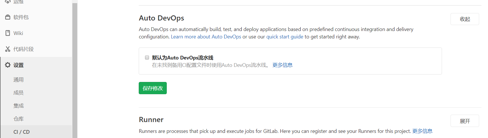

.gitlab-ci.yml 文件首先要符合 yaml 文件的规则，其次关键字要满足 gitlab 官方的定义[GitLab CI/CD Pipeline Configuration Reference](https://docs.gitlab.com/ee/ci/yaml/)，gitlab 自带了各种模板(如下图所示)，通过公司内 gitlab 扩展平台同步的 ci 模板就是基于内置的 Auto-DevOps 模板修改适配的。

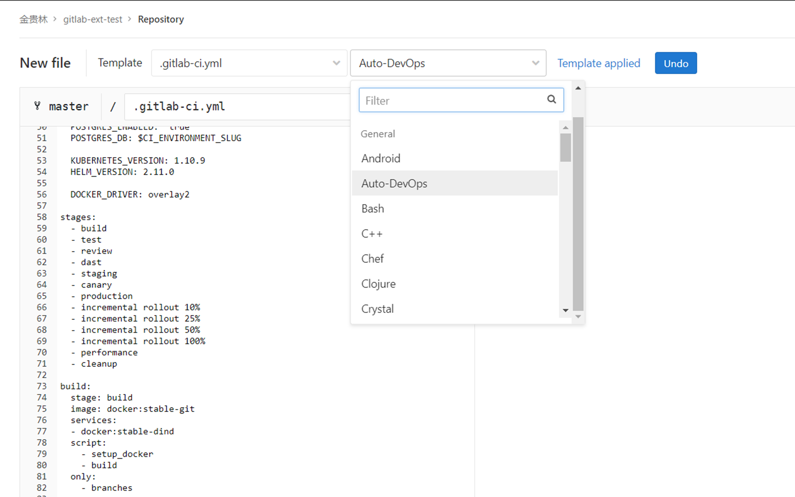

[.gitlab-ci.yml](/download/attachments/24929794/.gitlab-ci.yml?version=1&modificationDate=1580895014414&api=v2) 分析这样一个模板的内容，**variables:**  块定义了一些变量，**stages:**  块定义了流水线的阶段，**.auto_devops:**  定义了一些 shell 函数并在**before_script:**  中载入，剩下的是一系列的任务(job)。每个 job 用**stage:**  关键字定义归属于哪个阶段，缺省默认属于 test 阶段，同一个阶段的任务是并行的。

> **script:** 是一个 job 唯一必须的关键字。

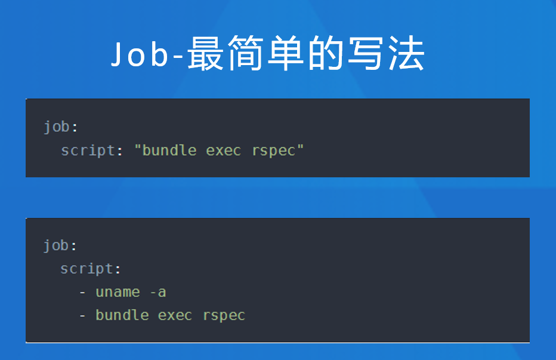

**Gitlab 预设 Auto Devops 流水线示例：**

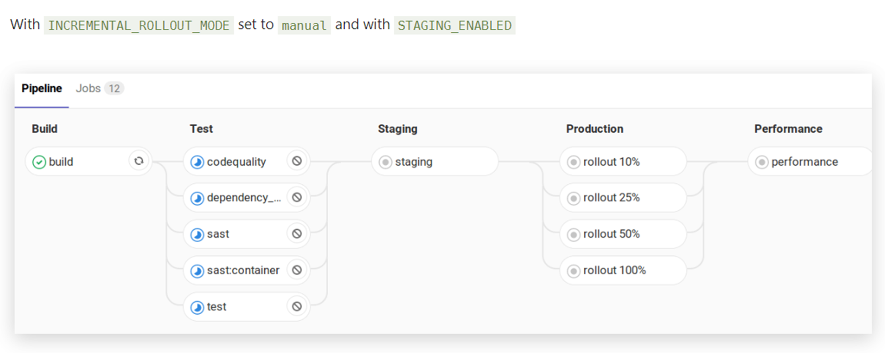

**build 任务分析：**

services 关键字说明这是个 docker in docker 的任务，DOCKER_DRIVER 变量搭配使用定义 dind 网络类型。script 中执行了两个预先定义好的函数，only 表示这个任务对所有分支有效。

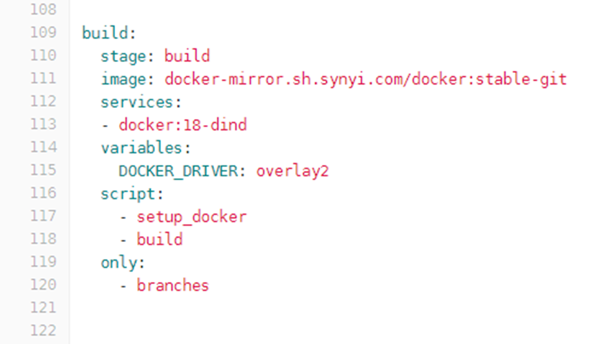

**production 任务分析:**

.production: 表示隐藏任务，&production_template 表示锚点名称，在 production 任务中通过<<： \*production_template 导入

script: 执行一系列预先定义的函数

environment: 会反映在 gitlab 项目的’运维‘ - ’环境‘页面中。

artifacts: 定义缓存的文件，可以在 gitlab 页面下载，默认保存 3 天。

only: 这里表示只适用于 gitlab runner 是 kubernetes 的 master 分支。

except: 表示当 3 个变量中的任何一个有效时不执行此任务。

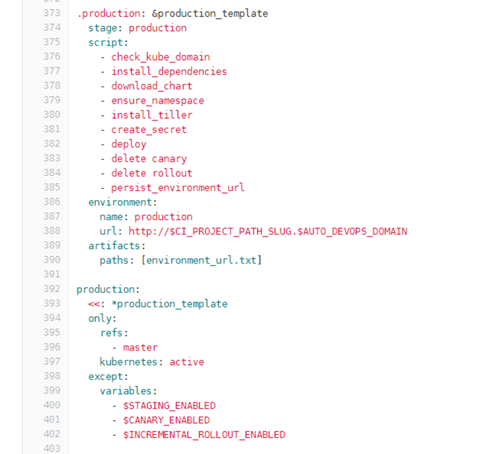

**only/except 多个条件的含义：**

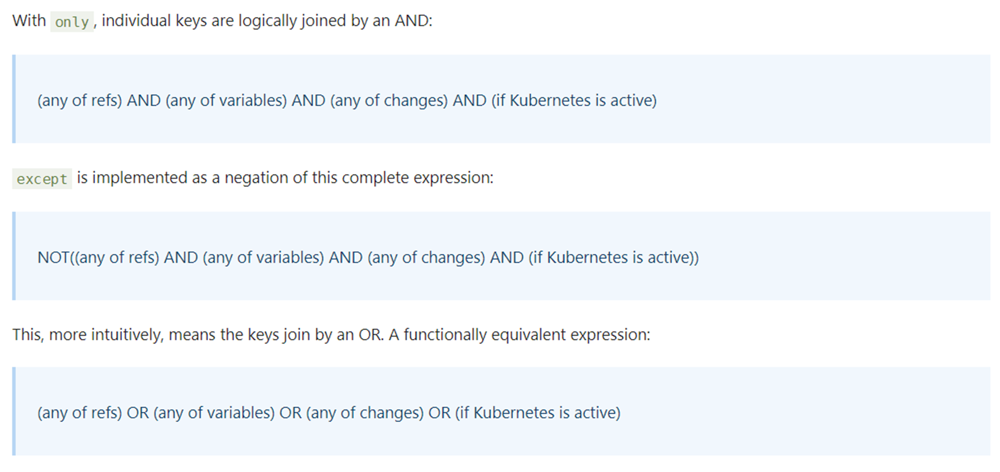

**如何跨项目触发流水线：**

使用 curl 调用 gitlab web api 触发，模板中的触发打包工程就是这样。需要注意 curl 命令中传入的变量。

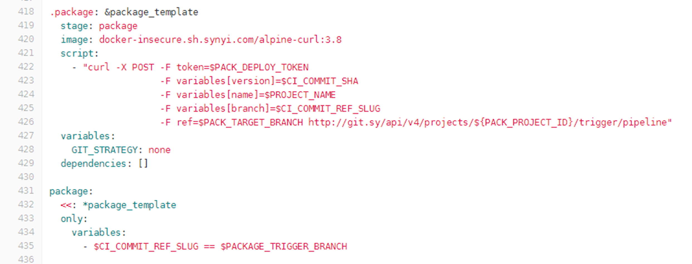

**尽量使用 gitlab 预定义的变量：**

在 script 中使用 export 命令可以打印查看所有 gitlab 预定义的变量。

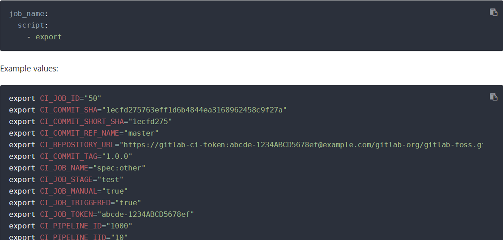

**如何调试流水线：**

- 通过 gitlab 页面上自带的 lint 检查.gitlab-ci.yml 文件的合法性，如[http://git.sy/jin.guilin/gitlab-ext-test/-/ci/lint](http://git.sy/jin.guilin/gitlab-ext-test/-/ci/lint)
- 设置 TRACE 变量值，即打开 set -x (在 before_script 中有预设，如下图所示)  
  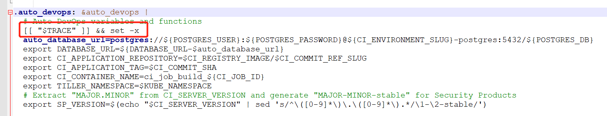
- 开启 CI_DEBUG_TRACE  
  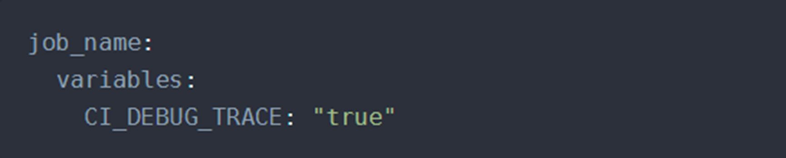
