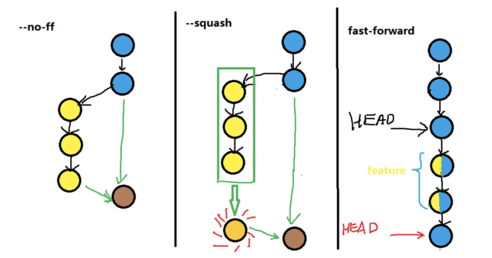
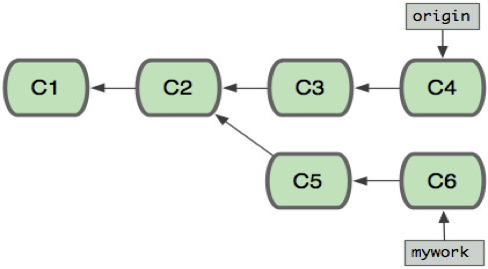
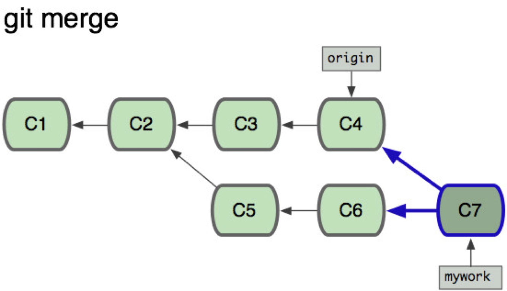
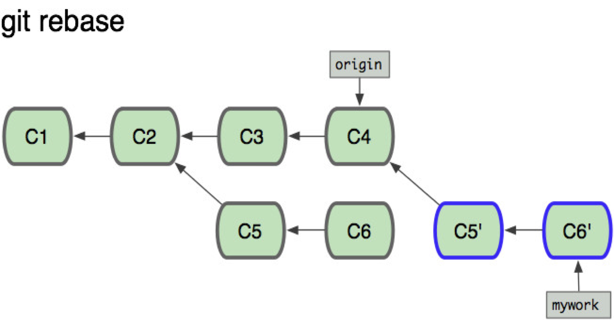

# Git Flow

## 一．版本号命名规则

v1.1.1…：第一位大版本号，大功能发布时增加，技术负责人审核；第二位小版本号，增加小特性时增加，主开发审核；第三位 BUG 修复号，修复 BUG 用，修复人员负责。

## 二、git flow 工作流程

**1.开发 feature：**

### a.获取 dev 分支最新代码：

git checkout dev

git pull

### b.使用 git flow 创建 feature 分支：

git flow feature start feature-name

### c.开发完成后，提交代码：

git commit -a -m "xxxxx"

### d.使用 git flow 完成 feature 分支：

git flow feature finish feature-name

### e.push 到 dev 分支

git push

**2.修复生产环境 BUG**

### a.获取 master, dev 分支最新代码：

git checkout dev

git pull

git checkout master

git pull

### b.使用 git flow 创建 hotfix 分支：

git flow hotfix start feature-name

### c.开发完成后，提交代码：

git commit -a -m "xxxxx"

### d.使用 git flow 完成 hotfix 分支：

git flow hotfix finish feature-name

### e.分别 push 到 dev 和 master 分支

git push

git checkout master

git push

## 三、其他注意事项

## 1.git merge 与 git rebase

a.git merge 命令是用于从指定的 commit(s)合并到当前分支的操作有--ff-only, --squash, --no-ff 模式。

`--ff-only` 方式就是当条件允许的时候，git 直接把 HEAD 指针指向合并分支的头，完成合并。属于"快进方式"，这种情况如果删除分支，则会丢失分支信息。因为在这个过程中没有创建 commit。

`--squash` 用来把一些不必要 commit 进行压缩，比如说，你的 feature 在开发的时候写的 commit 很乱，那么我们合并的时候不希望把这些历史 commit 带过来，使用--squash 合并，此时文件已经同合并后一样了，但不移动 HEAD，不提交。需要进行一次额外的 commit 来"总结"一下，然后完成最终的合并。

`--no-ff` 可以保存你之前的分支历史。能够更好的查看 merge 历史，以及 branch 状态。

参考：

[https://blog.csdn.net/wh_19910525/article/details/7554489](https://blog.csdn.net/wh_19910525/article/details/7554489)
