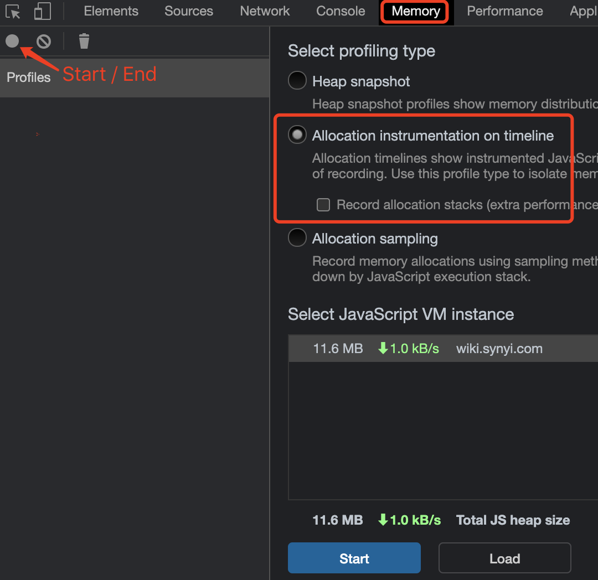
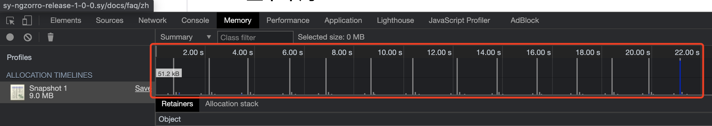
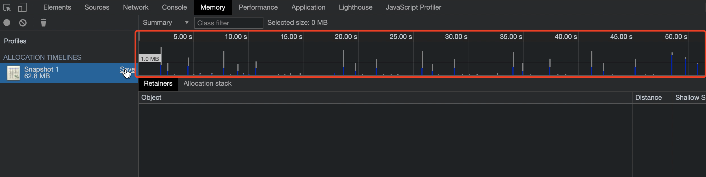

# 内存未回收路径说明及路径快照收集
### 基本原则

邀请测试协助，是希望识别出更广范围的路径测试，期望的产出物是 **有问题的**  路径说明+路径快照。对于 测什么？如何测？如何鉴别有问题这一标准 会在下述作出详细说明。

使用分配分析器进行EMR常用场景内存分析，对于测试，只需识别出 即可

时间点： 28 May 2021  覆盖住院主流程

### 基本测试环境

1.  测试项目：融合版住院医师站，地址：[http://inpatient-2250-develop.sy](http://inpatient-2250-develop.sy/)
    
2.  测试的浏览器：Chrome 的 无痕模式 ，浏览器版本号可忽略
    
3.  基本要求：清除浏览器所有 debug 断点，清除控制台console再测试
    
4.  测试工具：Chrome DevTools(F12)  >  Memory  >  Allocation instrumentation on timeline  
    
      
    
5.  记录要求： 频繁操作相同场景 **7** 次，前 6 次的操作在 timeline上  仍有 蓝色 条形柱 且 条形柱 size超过 1MB的需要保留到本地，用于后续分析
    
    每条测试路径运行一遍 heaptimeline，对于明显循环多次未被回收的路径，保留原始Snapshot，名称为Heap-senior${路径号}.heaptimeline，如： Heap-senior1.heaptimeline
    

  

  

### 鉴别工具

使用 Allocation instrumentation on timeline 可以查找未被正确地垃圾收回收，并继续保留在内存中的对象。 

在下面的图例1，图例2红框里的条形图表示对象什么时候在堆中被找到。

每个条形的高度对应最近分配的对象的大小，而其颜色表示这些对象是否仍然存在于最终堆快照中。**灰色** 则说明对象已经被垃圾回收器回收了，而 **蓝色** 表示在时间轴的最后该对象依旧存在。

例子1，在[http://sy-ngzorro-release-1-0-0.sy/docs/layout/zh](http://sy-ngzorro-release-1-0-0.sy/docs/layout/zh)应用中切换 「字体/布局」这两个页面 10 次，前面都已经是 **灰色** 表示对象已经被回收，那么对于这个路径我们可以鉴别为没有问题。

图例1: 没有内存泄漏的应用截图

  

  

例子2，进入患者主界面 –> **Start**  – 打开/关闭诊断弹出框 重复7次 – **End**。我们可以直观的看到前面6次 **蓝色** 存在表示对象仍然存在，size 有 1.0MB，那么对于这个路径我们可以鉴别为有问题，需要被记录在下表

图例2：存在问题的路径截图

  