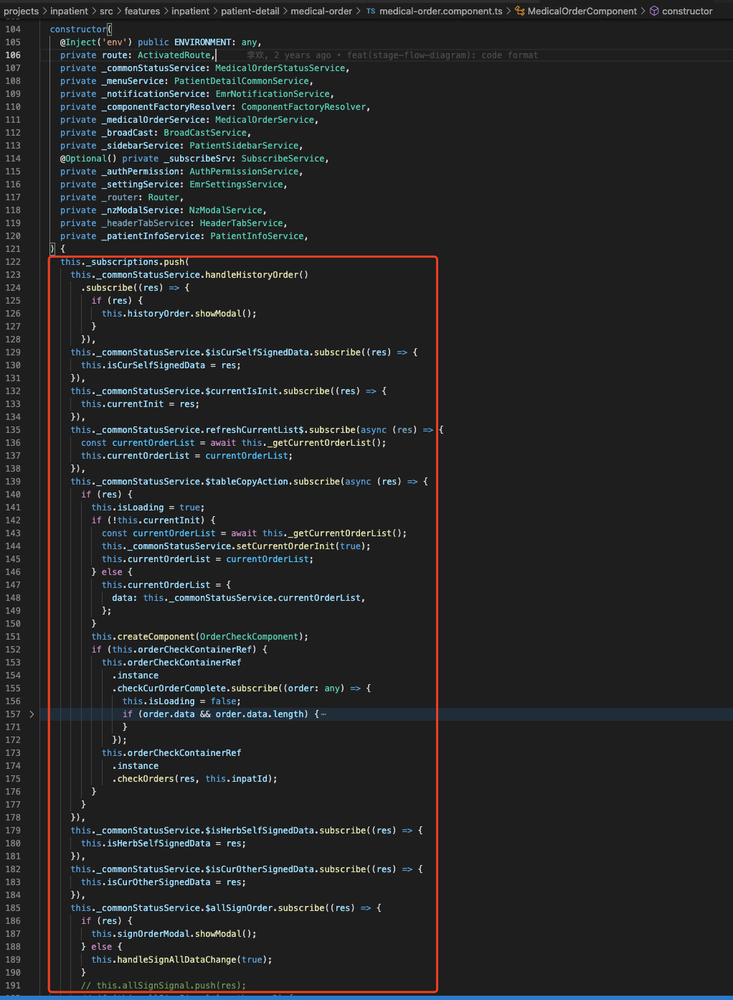

# 内存泄漏排查

### 问题描述

1.  医生的 emr 会出现页面内存占用大于 1G 的情况，大于 1G 后，如果系统内存剩余不多，就会有卡顿效果，诊断弹框打开明显会慢，切换患者会出现空白期；
2.  影响的操作有文书的新建、保存，打开操作，医嘱录入，诊断录入界面。loading 比较明显的在加载历史文书数据，会有 3-4 秒的加载时间，而且点开历史文书节点会有明显的迟钝效果，以及病案首页的保存签名操作。

## 方案

### 内存泄漏测试环境

> 考虑到 路由复用 也是内存增长的原因之一，本次内存泄漏排查标准第一步：**去除路由复用**， 待问题修复完再考虑增加 路由复用

1.  Chrome 浏览器-无痕模式
2.  清除所有 debug 断点，清除控制台 console
3.  本地以 localhost 启动项目时，修改代码关闭 Chrome 开发者工具，再进行页面刷新
4.  测试工具：Chrome DevTools > memory > heap snapshots
5.  record 要求： 频繁操作相同场景 **7** 次，记录 **7** 次 snapshots
6.  snapshot 分析： 查找那些 泄漏 **7** 次 **14** 次 等的 Objects； 2: snapshots 比较分析 `#6` 与 `#3`
7.  在 http://git.sy/yu.xiufang/inpatient develop 上修改测试验证

### 测试路径

> - 每条测试路径运行一遍 heaptimeline，对于明显循环多次未被回收的路径，保留原始 Snapshot，名称为 Heap-senior${路径号}.heaptimeline
> - 修改代码后，每条测试路径再运行一遍 heaptimeline，名称为 Heap-senior${路径号}-fix-${Timer}.heaptimeline

- **路径 1**：进入医嘱界面 -- 记录 snapshot -- 患者列表切换患者 7 次，每次等待 3s 记录 snapshot，完成 7 个 snapshot -- 结束
- **路径 2**：进入患者列表床位卡界面 -- 记录 snapshot -- 医生选择「全部」 -- 双击第 2 个床位卡 -- 点击 logo 森亿智能 --医生选择「全部」 -- 记录 snapshot -- 结束
- **路径 3**：进入患者列表床位卡界面 -- 医生选择「全部」 -- 记录 snapshot -- 双击第 2 个床位卡 -- 点击「医嘱」进入医嘱界面 -- 点击 logo 森亿智能 -- 医生选择「全部」-- 记录 snapshot-- 结束
- **路径 4**：选择十区 3 床患者孙芳，进入患者文书界面 -- 记录 snapshot -- 打开住院志/入院记录，等待 3s -- 点击 医嘱，进入界面等待 3s -- 点击 文书 -- 打开住院志/入院记录，等待 3s -- 记录 snapshot-- 结束
- **路径 5**：选择十区 3 床患者孙芳，进入患者文书界面 -- 打开住院志/入院记录 -- 记录 snapshot -- 点击切换书写助手 医嘱/报告 等待 3s（循环 -- 记录 snapshot-- 结束
- **路径 6**：选择十区 3 床患者孙芳，进入患者文书界面 -- 打开住院志/入院记录 -- 记录 snapshot -- 点击切换书写助手 医嘱/片语 预览 1 个片语 等待 3s（循环 -- 记录 snapshot-- 结束
- **路径 7**：选择十区 3 床患者孙芳，进入患者文书界面 -- 打开住院志/入院记录 -- 记录 snapshot -- 点击切换书写助手 医嘱/历史就诊 预览第一份文书/住院志/入院记录 等待 3s（循环 -- 记录 snapshot-- 结束
- **路径 8**：进入住院组套维护界面 -- 记录 snapshot -- 点击切换 tab（科室 => 个人 => 全院循环 5 次）-- 记录 snapshot -- 结束
- **路径 9**：进入住院组套维护界面 -- 记录 snapshot -- 选中科室 tab -- 点击切换叶子节点-- 记录 snapshot -- 结束
- **路径 10**：进入常用模板维护界面 -- 记录 snapshot -- 点击切换 tab（片语 => 组套循环 5 次）-- 记录 snapshot -- 结束
- **路径 11**：进入常用模板维护界面 -- 记录 snapshot -- 选中片语 tab -- 点击切换叶子节点-- 打开右侧编辑器 -- 记录 snapshot -- 结束
- **路径 12**：进入常用模板维护界面 -- 记录 snapshot -- 选中片语 tab -- 点击切换叶子节点和非叶子节点（二级文件夹）-- 右侧编辑器显示（叶子节点）/隐藏（非叶子节点） -- 记录 snapshot -- 结束
- **路径 13**：进入常用模板维护界面 -- 记录 snapshot -- 选中文件夹 -- 点击“+片语”新建片语 -- 输入片语名称 -- 保存 -- 记录 snapshot -- 结束
- **路径 14**：进入常用模板维护界面 -- 记录 snapshot -- 选中个人片语文件夹 -- 点击“+文件夹”新建文件夹 -- 输入片语名称 -- 保存 -- 记录 snapshot -- 结束
- **路径 15**：进入临床路径管理界面 -- 记录 snapshot -- 点击“+新增”按钮弹出弹框 -- 输入字段保存 -- 记录 snapshot -- 结束 （1M 左右）

#### code 1: 去除路由复用

**代码路径：**`src/app/global.module.ts`

[?](#)

<table border="0" cellpadding="0" cellspacing="0"><tbody><tr><td class="code"><div class="container" title="Hint: double-click to select code"><div class="line number1 index0 alt2"><code class="js plain">public static forRoot(): ModuleWithProviders&lt;GlobalModule&gt; {</code></div><div class="line number2 index1 alt1"><code class="js spaces">&nbsp;&nbsp;&nbsp;&nbsp;</code><code class="js keyword">return</code> <code class="js plain">{</code></div><div class="line number3 index2 alt2"><code class="js spaces">&nbsp;&nbsp;&nbsp;&nbsp;&nbsp;&nbsp;&nbsp;&nbsp;</code><code class="js plain">ngModule: GlobalModule,</code></div><div class="line number4 index3 alt1"><code class="js spaces">&nbsp;&nbsp;&nbsp;&nbsp;&nbsp;&nbsp;&nbsp;&nbsp;</code><code class="js comments">// providers: [...PROVIDES], // 注释掉此代码即可全局去除路由复用</code></div><div class="line number5 index4 alt2"><code class="js spaces">&nbsp;&nbsp;&nbsp;&nbsp;</code><code class="js plain">};</code></div><div class="line number6 index5 alt1"><code class="js plain">}</code></div></div></td></tr></tbody></table>

#### code 2: 医嘱在去除路由复用之后，需要在 `ngOnInit` 生命周期里加入下述代码保障运行正常

**代码路径：**`projects/inpatient/src/features/inpatient/patient-detail/medical-order/current-order/order-list/order-list.component.ts`

[?](#)

<table border="0" cellpadding="0" cellspacing="0"><tbody><tr><td class="code"><div class="container" title="Hint: double-click to select code"><div class="line number1 index0 alt2"><code class="js plain">public ngOnInit(): void {</code></div><div class="line number2 index1 alt1"><code class="js spaces">&nbsp;&nbsp;&nbsp;&nbsp;</code><code class="js plain">... </code><code class="js comments">// 下述代码仅在去除路由复用之后使用</code></div><div class="line number3 index2 alt2"><code class="js spaces">&nbsp;&nbsp;&nbsp;&nbsp;</code><code class="js keyword">this</code><code class="js plain">._activatedRoute.params</code></div><div class="line number4 index3 alt1"><code class="js spaces">&nbsp;&nbsp;&nbsp;&nbsp;&nbsp;&nbsp;&nbsp;&nbsp;</code><code class="js plain">.pipe(map(params =&gt; +params[</code><code class="js string">'inpatId'</code><code class="js plain">]))</code></div><div class="line number5 index4 alt2"><code class="js spaces">&nbsp;&nbsp;&nbsp;&nbsp;&nbsp;&nbsp;&nbsp;&nbsp;</code><code class="js plain">.subscribe(inpatId =&gt; {</code></div><div class="line number6 index5 alt1"><code class="js spaces">&nbsp;&nbsp;&nbsp;&nbsp;&nbsp;&nbsp;&nbsp;&nbsp;&nbsp;&nbsp;&nbsp;&nbsp;</code><code class="js keyword">this</code><code class="js plain">.inpatId = inpatId;</code></div><div class="line number7 index6 alt2"><code class="js spaces">&nbsp;&nbsp;&nbsp;&nbsp;&nbsp;&nbsp;&nbsp;&nbsp;&nbsp;&nbsp;&nbsp;&nbsp;</code><code class="js keyword">this</code><code class="js plain">._getTableData(</code><code class="js keyword">this</code><code class="js plain">.inpatId, </code><code class="js keyword">this</code><code class="js plain">.commonService.deptId, </code><code class="js keyword">true</code><code class="js plain">);</code></div><div class="line number8 index7 alt1"><code class="js spaces">&nbsp;&nbsp;&nbsp;&nbsp;&nbsp;&nbsp;&nbsp;&nbsp;</code><code class="js plain">});</code></div><div class="line number9 index8 alt2"><code class="js plain">}</code></div></div></td></tr></tbody></table>

#### Observable 增加 takeUntil operator

原先的 Observable 增加 Pipe(), Pipe() 内部最后增加 takeUntil() 操作符。修复示例如下：

```Typescript
export class xxComponent implements OnInit, OnDestroy {
  //  ...
  private destroy$ = new Subject<void>(); // 新增

  public ngOnInit() {
    // example 1
    xxxObservable.pipe(takeUntil(this.destroy$)).subscribe()

    // example 2
    xxxObservable.pipe(
        switchMap(),
        takeUntil(this.destroy$)
     )
    .subscribe()

    // example 3
    xxxObservable.pipe(
        map(value => value[0] || value[1]),
        debounceTime(50),
        distinctUntilChanged(),
        takeUntil(this.destroy$)
     )
    .subscribe()
  }

  public ngOnDestroy(): void {
    this.destroy$.next();
    this.destroy$.complete();
  }
}
```

#### 业务逻辑初始化滥用 constructor，初始化挪到 Angular 的生命周期里

需要修正初始化逻辑，业务初始化逻辑应放在 ngOnInit 生命周期里，此错误修复范围是全局

- `constructor:` 用来依赖注入+设置成员属性默认值
- `ngOnInit:` 处理业务初始化逻辑

  错误示例如图
  
