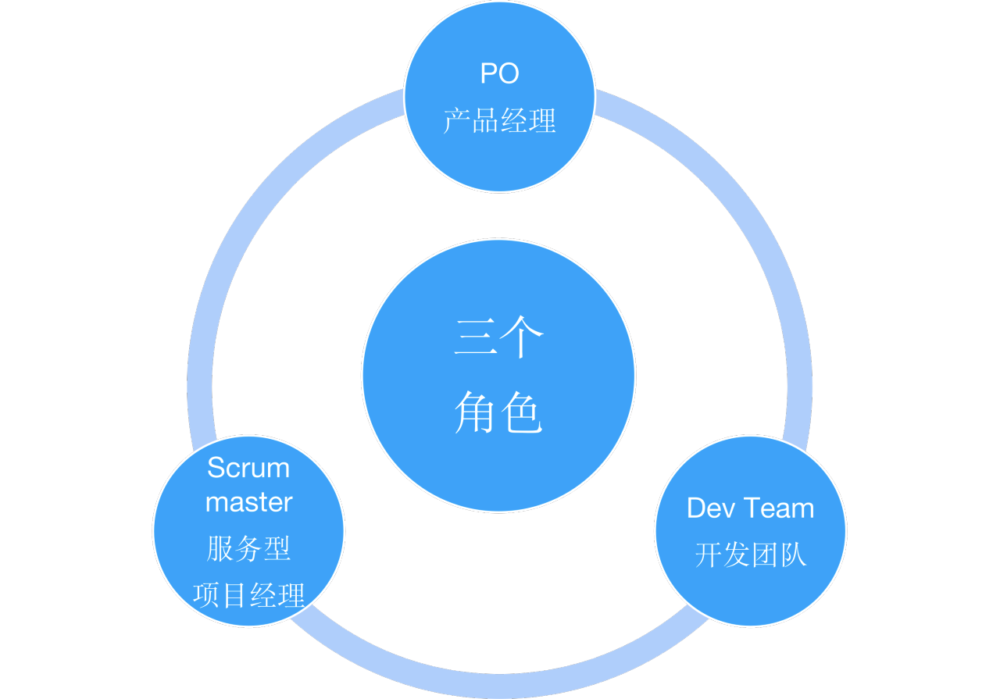
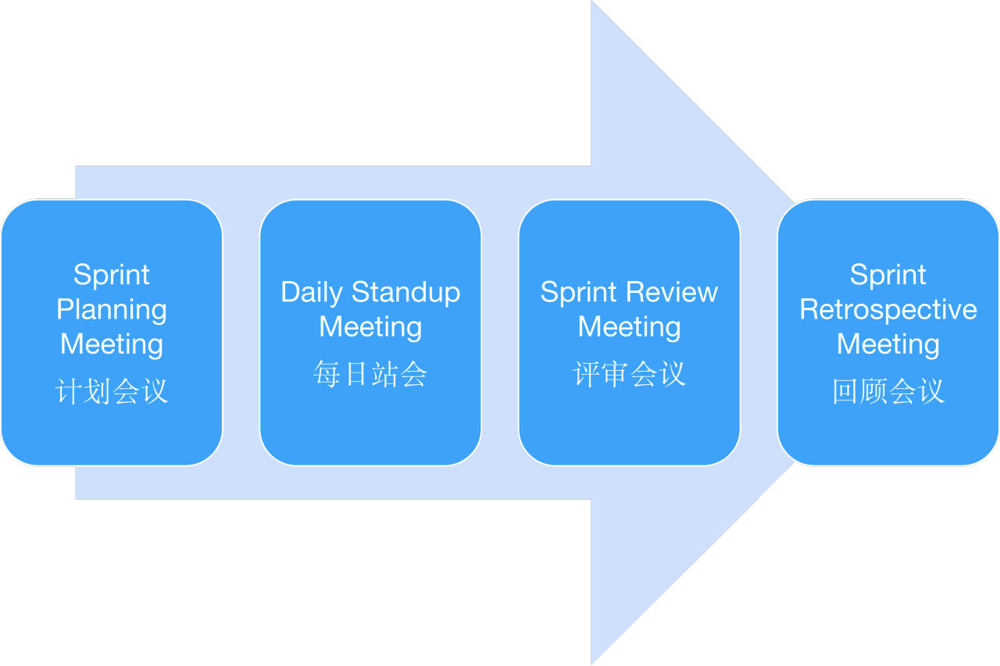
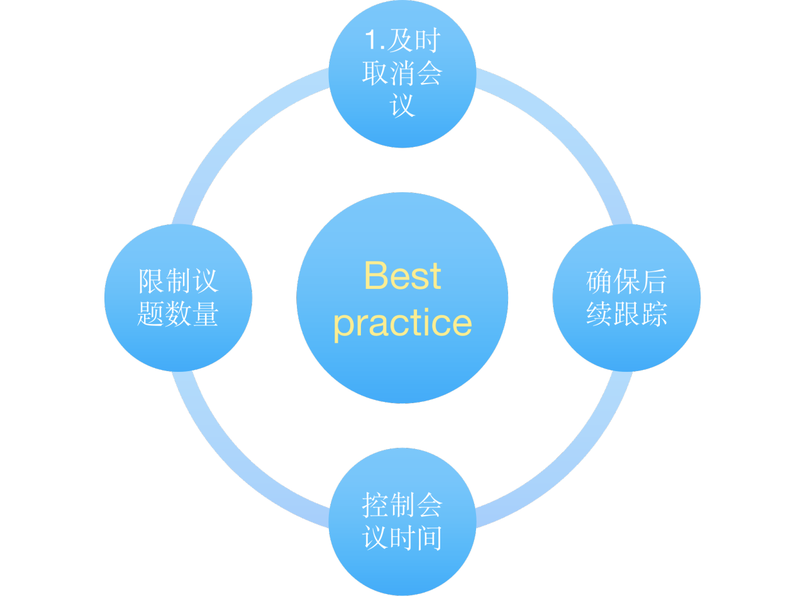
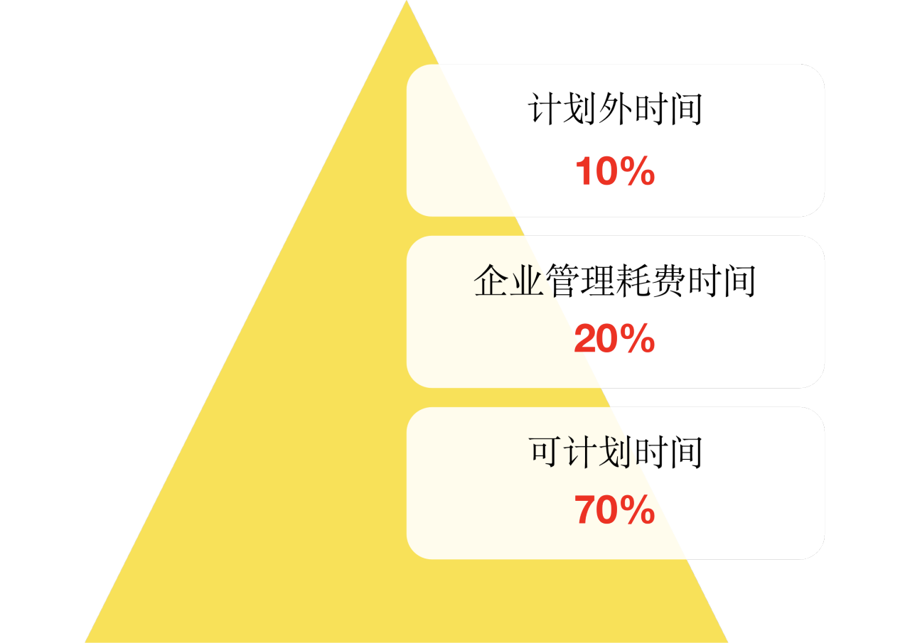
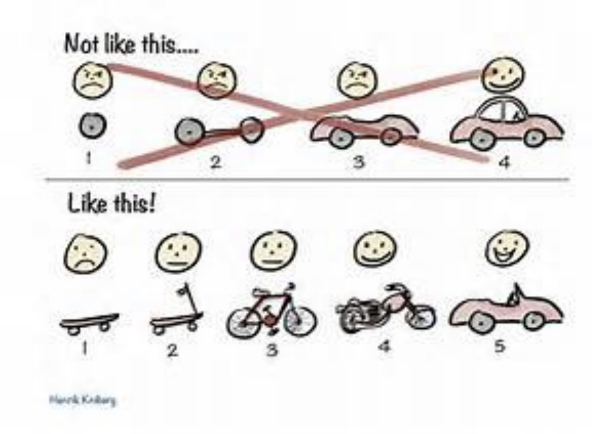

# 在团队运作 Scrum 记录

## 01 SM 简介

### Scrum 关键概念

Scrum 包含一系列[sprint](https://www.visual-paradigm.com/scrum/what-is-sprint-in-scrum/)或开发迭代。每个 Scrum sprint 都涉及相同的过程：角色（人），事件（会议）和[工件](https://www.visual-paradigm.com/scrum/what-are-scrum-artifacts/)（有形副产品）。

- - Sprint 是重复的开发周期，直到您的项目完成。
  - 在每个 sprint 中开发，测试，集成和批准需求（通常以用户故事的形式）。这个过程在冲刺后继续冲刺。

如前所述，Scrum 框架由三个不同的类别组成\*\*：角色\*\*，**事件**和**工件**：

### Scrum 角色

Scrum 框架由三个核心角色定义：开发团队，Scrum Master 和产品负责人。

### Scrum 活动

Scrum 框架由五个事件标记。这些是 Sprint，[Sprint Planning](https://www.visual-paradigm.com/scrum/what-is-sprint-planning/)，[Daily Scrum](https://www.visual-paradigm.com/scrum/daily-scrum-meeting-quick-guide/)，[Sprint Review](https://www.visual-paradigm.com/scrum/what-is-sprint-review/)和[Sprint Retrospective](https://www.visual-paradigm.com/scrum/what-is-sprint-retrospective-meeting/)。

### Scrum 生命周期

Scrum 生命周期从优先级积压开始，但没有提供关于如何开发或优先处理积压的任何指导，其中包括一系列 Sprint，它们将最终结果作为潜在的可交付产品增量产生，如下图所示。

在这些冲刺中，产品开发所需的所有活动都发生在整个产品的一小部分上。以下是 Scrum 生命周期中关键步骤的说明：

敏捷的 Scrum 框架

- 业务设定优先级，团队自行组织以确定提供最高优先级功能的最佳方式。
- 产品负责人代表业务方，负责维护产品功能列表，称为产品待办事项，并设置开发优先级。
- 在 sprint 计划期间，团队从该愿望列表的顶部提取一小部分，sprint 积压，并决定如何实现这些部分。
- Scrum 流程基于称为 Sprints 的迭代周期，通常持续 2-4 周，在此期间对产品进行设计，编码和测试，同时每天开会以评估其进度（每日 Scrum）。
- 在此过程中，Scrum Master 让团队专注于其目标。
- 在 sprint 结束时，工作应该可以发送给利益相关者。
- 冲刺以冲刺回顾和回顾会议结束。
- 随着下一个 sprint 的开始，团队选择了产品积压的另一大块并开始重新开始工作。
- 该项目将持续到完成整个愿望清单，或者由于时间或预算已经用尽而停止。
- 这种情况一直持续到项目被认为完成为止，要么停止工作（截止日期，预算等），要么完成整个愿望清单。

## 02 SM 最佳实践

### 如何降低会议成本？

Timebox 的概念，比如说一个 Sprint 2 周或者 3 周，其实并不是一个需求一定限制死在这个时间内。 举个例子，比如开会，我们发会议邀请的时候， 一般都会评估是一个小时还是 2 小时。但是并不意味着只能在这个 timebox 内完成。 但是有了 timebox 大家会有紧迫感，也会有目标。不至于太发散。

被迫在严格的框架里工作时，人们总能把想象力发挥到极致，并想出最绝妙的主意。拥有完全自由时，人们的思绪反而可能无限蔓延。 ---T.S. 艾略特，诗人

### 新任务不断添加进来， 团队应该如何应对？

#### 计划外时间：

- 比如突发的 demo, 或者突然收到医院反馈的一些紧急问题。或者 hotfix 一些紧急部署
- 个人遇到一些紧急的不能预料的事情，需要请假

#### 企业管理耗费时间：

- 每日站会
- 各种需求，方案，设计讨论
- 可计划时间： 专心做自己工作的时间，比如专心编码或者专心写测试用例

### INVEST 原则

#### I dependent(独立的)要尽可能的让一个用户故事独立于其他的用户故事

独立性（Independent）— 指的用户故事间的依赖控制程度。在进入迭代前，用户故事间的依赖程度必须是已经解耦到了这样一种程度：可以在一个迭代内实现所有强依赖的用户故事。如果不能在一个迭代内实现所有强依赖的用户故事，则意味着需要对用户故事重新进行定义和拆分。

- 用户故事必须是独立的： 用户故事可以有和其他故事的接口或者依赖, 但是作为故事本身，我们需要把他描述成独立的
- 如果故事不能独立，就要合并， 或者如果某些故事会阻碍其他的用户故事在一个迭代内完成最好将他们分解
- 作为写用户故事的指导，故事可以围绕“一个任务”而有一定的独立性，并且提供可测性

解释

> 从“从账单库里面获取账单信息”不够独立。客户真正需要的是一个打印出来的账单，这样他可以邮寄给客户。可以将”打印账单”和当前 story 合并。如果将数据取出，打印一个迭代做不完的话，可以进行“垂直划分”。将取得账单一部分信息并打印作为一个 story, 然后将取得账单另外一部分信息并打印作为另外一个 story, 直到可以取得所有的信息打印完成。

#### N egotiable(可商榷的)用户故事不是签订的商业合同，它是由客户或者产品经理同开发小组的成员共同协商制定的

- 用户故事可商榷可以让需求更加灵活，简洁勿需精确
- 用户故事细节的讨论空间可以让 PO,开发，客户共同讨论，了解 story 的真正意图
- 用户故事如果过于精确会给人不合理的感觉 – 如果细节过多，会让开发觉得只能做成这样。 这种情况下违背了用户故事的 3C 原则
- 用户故事是一个用来建立沟通的工具

解释

> 反例：看起来还不错，以为可以开始开发状态，但是事实还有很多信息需要额外分析。
> 3C 原则 ： Card, Customer, Communication 强调需要 Balance

#### V aluable(有价值的)用户故事必须对于最终的用户是有价值的，因此应该站在用户的角度去编写

- 将需要的功能分解（例如看到”过期的付款记录”和”可视化的提醒”）
- 找到哪个用户对此需要有兴趣（不同角色有不同需求）
- 发掘的商业价值或者原因

**Bad Story** 当延误付款的时候将字体变红

**Good Story**
作为一个客户经理，我想要看到客户过期付款记录上有可视化的提醒，从而我可以提醒客户付款
解释

> 反例问题：我们不知道谁需要字体变红，为什么要变红。或许用户并不需要字体变红，只不过这是当前系统的处理方法。

#### E stimable(可估算的)确认故事的规模是否已经足够小，以及确认团队是否已经对故事有足够的了解，并对技术实现方案基本达成一致

**Bad Story** 作为银行柜员，我想要从信用卡上扣取款项，从而可以赚到钱
**Good Story Story1a** 作为银行柜员，我想要从美国运通上扣取款项，从而可以赚到钱。
**Good Story Story1b** 作为银行柜员，我想要从 VISA 和万事达上扣取款项，从而可以赚到钱。
解释

> 反例太大了，不能准确估算。 3 个信用卡类型，只创建了两个 story, 原因是因为 Visa 和万事达的接口及其类似，只要做一点点小的变化就可以同时支持两种卡类型。

#### S mall(足够小的)最好的故事是能够在一个迭代周期之内完成的。如果太大就应该考虑将其拆分为多个粒度更小的用户故事

**Bad Story** 可以让用户付款（一个 Story）
**Good Story Story1a** 作为客户经理，我想要记录和显示基本付款信息，从而可以检查其是否正确
**Good Story Story1b** 作为客户经理，我想要基本付款信息可以被查询, 从而记录用户信用
**Good Story Story1c** 作为客户经理，我想要在搜索报告数据库的时候看到客户的付款信息，从而我知道账单上是否有这个款项
**Good Story Story1d** 作为客户经理，我想要客户的账单上有需付款项，从而让他们可以付款
解释

> 在迭代级别，一个 story 如果需要一个迭代以上的时间完成，就需要必须分解。 一个大的 story 通常是多个 story 的集合 垂直分解 Story

#### T estable(可测试的)在明确的输入下有明确的输出，在迭代前我们要确认的是：是否所有用户故事都已经完成测试要点的讨论和整理

Story 的可测性有两个级别:

- 在没有验收条件的情况下，Story 本身可以测试一个 happy path
- 当有验收条件时，每个验收条件是可测的

对于以上两个级别，所有的需求都可以进行自动化测试。不应该有含糊的逻辑，或者难懂的分解。

**Bad Story** 获取外链的类型
**Good Story** 作为一个用户，我想在我们登录之后在首页上看到我保存的外部网站链接,从而我可以方便的使用这些链接

解释

> 如何测试外链类型当开发和测试都很迷茫，但是重新描述后就变得很简单

### 终极目标 Working Software

