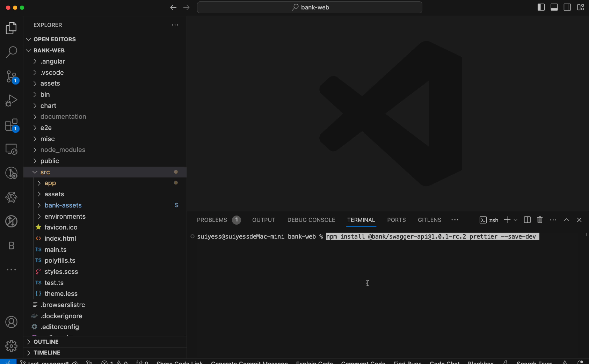

# Swagger 到 TypeScript 代码生成指南

> [github repo](https://github.com/Sofia92/swagger-typescript-api)

## 环境准备

### 1. 安装核心工具

```bash
npm install @bank/swagger-api@1.0.3 prettier --save-dev
```

> **版本说明**：`@bank/swagger-api` 是封装了 `swagger-typescript-api` 的企业定制版生成工具



### 2. 依赖验证

确保项目已包含以下开发依赖：

```json
{
  "devDependencies": {
    "typescript": "^4.0+",
    "axios": "^0.21+"
  }
}
```

---

## 配置说明

### 1. 配置文件模板

在项目根目录创建 `.swagger-api.config.json`：

```json
{
  "outputDir": "__generated__",
  "schemasKey": "schemas",
  "apiJsons": [
    {
      "name": "ir",
      "path": "http://bank-web-4560-develop.sy/api/ir/swagger/ir/swagger.json",
      "network": "IRNetworkService"
    },
    // 其他服务配置...
    {
      "name": "edc",
      "path": "http://bank-web-4560-develop.sy/api/edc/swagger/v1/swagger.json",
      "network": "EDCNetworkService",
      "priority": 1 // 解决重复定义问题
    }
  ]
}
```

### 2. 关键配置项说明

| 字段        | 说明                                                     |
| ----------- | -------------------------------------------------------- |
| `outputDir` | 生成文件输出目录（建议加入 `.gitignore`）                |
| `priority`  | 定义生成顺序，数值越大优先级越高（解决枚举重复定义问题） |
| `network`   | 生成的网络请求层类名（每个服务独立）                     |

---

## 代码生成流程

### 1. 集成生成命令

修改 `package.json` 的启动脚本：

```diff
"scripts": {
- "start": "ng serve",
+ "start": "swagger-gen && ng serve",
  "swagger-gen": "swagger-api generate -c .swagger-api.config.json"
}
```

### 2. 执行生成命令

```bash
npm run swagger-gen
```


**生成文件结构**：

```
├── __generated__
│   ├── ir-api.service.ts
│   ├── edc-api.service.ts
│   └── typings.ts  # 完整Schema定义，包括interface、enum
```

---

## 基础使用示例


```typescript
import { CollectionAPIService } from "../__generated__/collection-api.service";

@Injectable()
export class CollectService {
  constructor(private collectionApi: CollectionAPIService) {}

  async fetchCollectData() {
    return this.collectionApi.PosthomePageTypeCollectType(collectType, {
      pageIndex,
      pageSize,
      keyword,
    });
    // return this.collectionNetwork.post(`/home-page/type/${collectType}`, { pageIndex, pageSize, keyword })
  }
}
```

## 常见问题处理

### 1. 重复类型定义

**现象**：`RealData.Entity.Contract.Enums.CRFItemType` 重复  
**解决方案**：

1. 在配置文件中为包含完整定义的服务设置更高优先级
2. 执行后删除 `__generated__/shared/duplicated` 目录

### 2. 字段丢失问题

**调试步骤**：

```bash
DEBUG=swagger-api* npm run swagger-gen
```

检查控制台输出的原始 Swagger 数据结构

### 3. 版本回退

```bash
npm install @bank/swagger-api@1.0.2 --save-dev
```

---

> **文档维护提示**：当后端接口更新时，执行 `npm run swagger-gen -- --force` 强制重新生成
