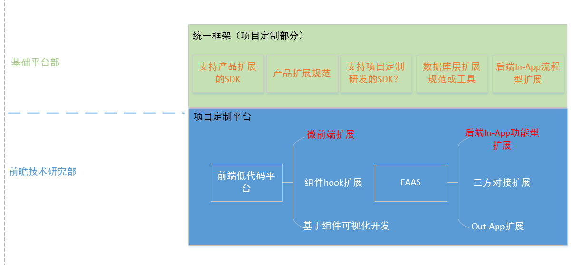
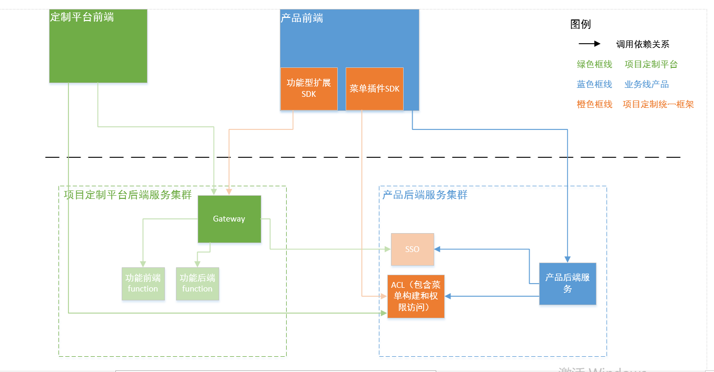

# [统一框架]功能型扩展设计方案_draft

# 项目定制整体方案简述

基础能力研发部内部多次对齐后，关于项目定制的实现方案主要依托于项目定制平台来实现，项目定制平台包含两大核心子系统分别是 FAAS 和前端低代码平台，然后统一框架基于项目定制平台面向产品研发提供各种 SDK。下面的草图是当时讨论时候画的，可以简单反映一下项目定制整体方案：

# 功能型扩展概念定义

功能型扩展指相对独立的业务功能的扩展，从前端新增页面，到后端 API 和存储表都是做独立的新增扩展。

# 关键设计思路

## 动态插件菜单

基于 ACL 的能力来动态构建权限菜单，助力后续产品功能型扩展。

## 基于 iframe 的微前端扩展

前端通过 iframe 对接项目定制平台输出的前端静态资源，

# 设计方案

## 前端扩展 SDK

针对前端路由级的功能性扩展（例如整页的 Iframe），SDK 会提供一个 Angular Component。

将该 Component 注册到约定的扩展功能用路由地址（例如/extension/\*\*）后，即可通过将页面导航至该路由地址，SDK 提供的 Component 会按约定的格式解析路由，并通过 FASS 平台提供的 extension manifest 来渲染对应的 Iframe 或是其他形式的扩展。

## ACL 前端 SDK（菜单插件 SDK）

通过引入 ACL 的前端 SDK，SDK 会向 Angular 的注入器提供 MenuService。

注入 MenuService 后，可以通过 MenuService 提供的方法获取到该用户可见的菜单树数据，可以通过该数据来渲染界面上的侧边栏菜单。

插件页面对应菜单节点的跳转地址填写约定的扩展功能用路由地址（例如/extension/feature-a），由前端扩展 SDK 来处理该路由地址并加载对应插件提供的页面。

换言之，在 ACL 这一层是并没有"扩展"的概念的。

## ACL(基于 PBAC 的菜单权限增强)

ACL 支持管理菜单树，以及为特定用户基于他拥有的资源权限生成其可见的菜单树。在生成菜单的过程当中，使用了 ACL 基于策略的认证算法。

因此要使用该功能，需要：

1.  在 ACL 中注册菜单按钮节点，其中包含该节点显示的情况下所需的资源权限，以及该节点的元信息（图标，文本，点击后要展示的内容）。
2.  在 ACL 中注册满足该节点需求的资源权限的策略
3.  在 ACL 中将该策略与用户或角色进行绑定

ACL 除了支持通过上传 Yaml 的方式导入菜单树和策略，还支持通过接口的方式动态增减菜单树以及策略。

FASS 平台在管理插件的时候，可以调用 ACL 的接口来动态添加或删除插件相关的策略和菜单节点。

鉴于 ACL 的 PBAC 模型略为复杂，在实际项目定制的使用当中可能会难以上手，在此提出一种简化用法，即：

- 基于功能点权限（Permission）的思路进行设计
- 针对单个权限，将 PBAC 中的 Resource 和 Action 融合在一起。例如"查看日志"这一功能点，将 Resource 和 Action 都写成`sy::logging::view-log`。
- 一条策略只对应一个功能点权限
- 一个菜单节点对应一个或若干个功能点权限

以上用法可以包装成一个接口来简化使用（放在 FASS 里之类的？）
