背景

1.  前端基础架构是什么？前端团队运行所必需的规范、工具和系统的体系
2.  公司目前没有规范的前端基础架构，导致个团队内部生成了各类形态的架构
3.  已有的基础库混乱，各团队成员重复造轮子，通用库维护和迭代流程不清晰
4.  部分产品线存在后端编写前端代码，后期维护成本由前端承担
5.  如果形成一致认可的架构规范，以及相对应的脚手架工具，将会提高前端人员的效率

# 目录

- 1[目录](#id-前端架构规范-目录)
- 2[一、观摩大厂架构](#id-前端架构规范-一、观摩大厂架构)
- 3[二、前端架构思路](#id-前端架构规范-二、前端架构思路)
- 4[三、规范](#id-前端架构规范-三、规范)
  - 4.1[总体项目组织结构](#id-前端架构规范-总体项目组织结构)
    - 4.1.1[Blogs、Documents 等聚焦于内容的 WebSites 组织结构](#id-前端架构规范-Blogs、Documents等聚焦于内容的WebSites组织结构)
    - 4.1.2[Angular 项目组织结构](#id-前端架构规范-Angular项目组织结构)
  - 4.2[项目架构规范](#id-前端架构规范-项目架构规范)
  - 4.3[Feature 架构规范](#id-前端架构规范-Feature架构规范)
- 5[五、CLI 建设](#id-前端架构规范-五、CLI建设)
- 6[参考文档](#id-前端架构规范-参考文档)

# 一、观摩大厂架构

### 腾讯

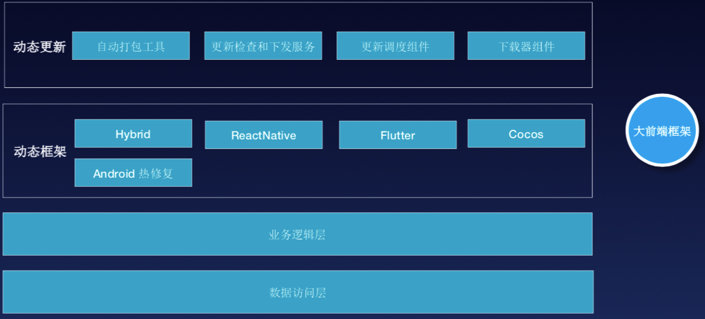
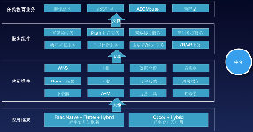
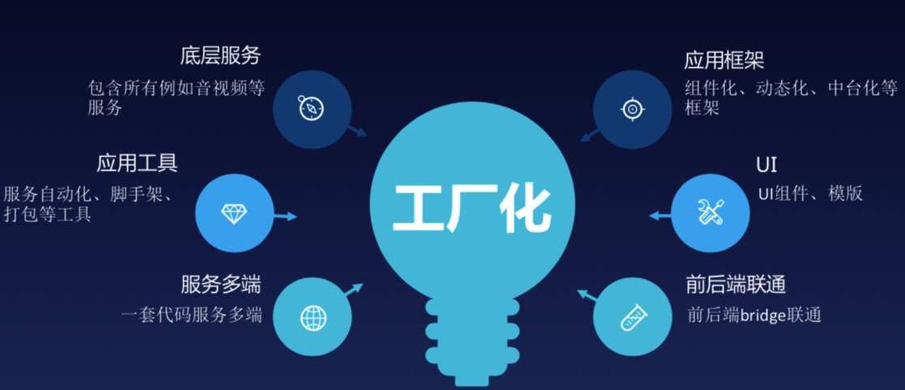

### 京东

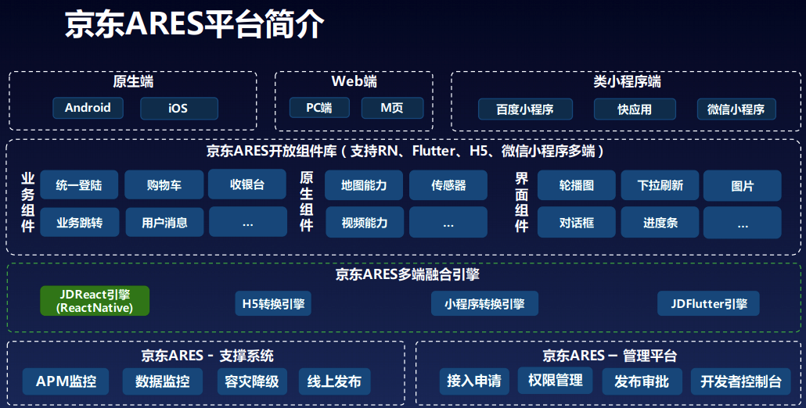

### 淘宝 Serverless

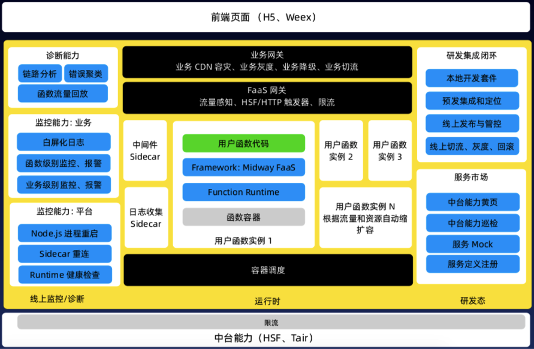

### 蚂蚁金服 BigFish

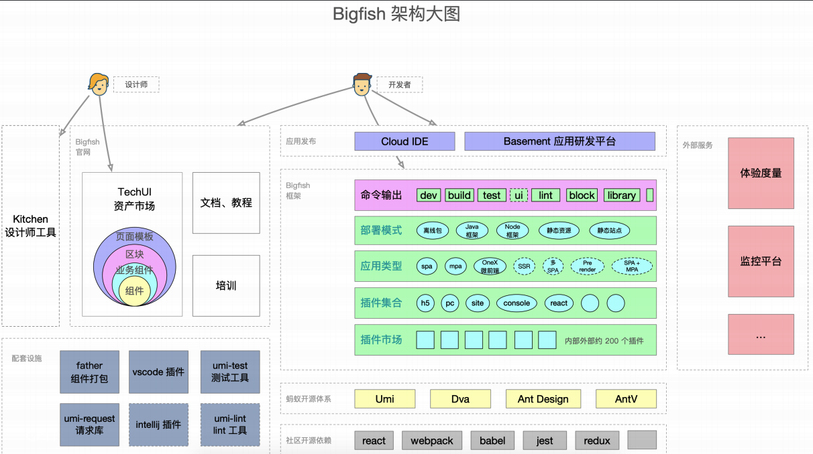

### 咸鱼 Flutter

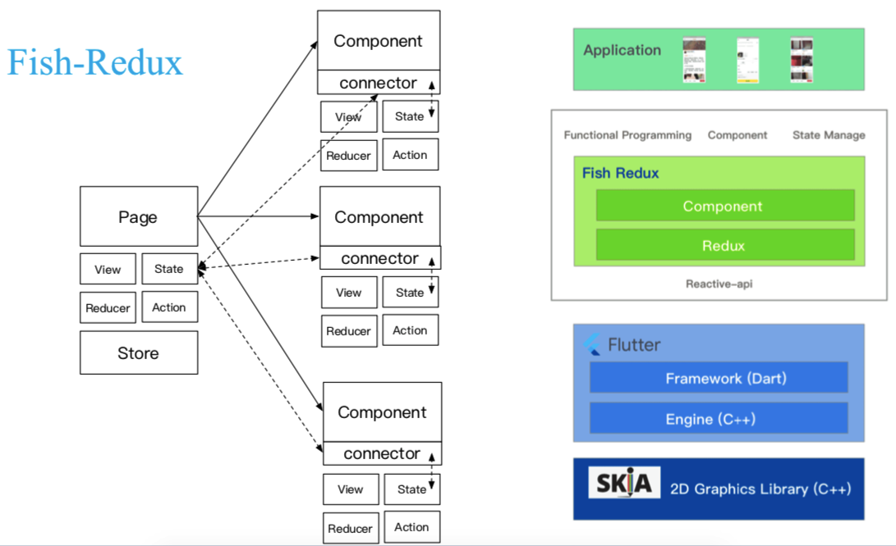

### 滴滴

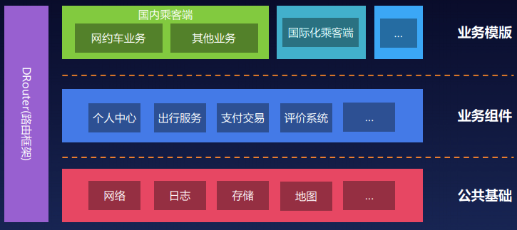

### 快手直播 Web 端 VUE+SSR

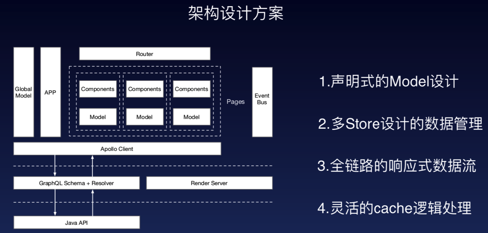

### 网易严选 - 跨框架组件

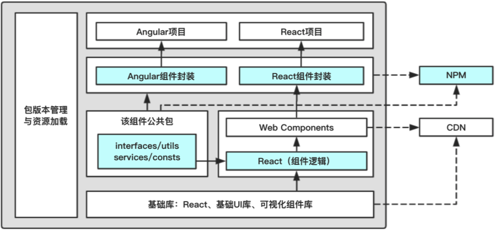

# 二、前端架构思路

阶段：基础组件库 => 业务组件库 => 中台化 => 工程化

四方面：基础组件库建设、业务组件库沉淀、规范、工具链、知识管理

项目组件化、规范的通用库维护流程、自动化构建流程、基础功能自动化

### 研发规范

    - 设计规范
    - 开发规范
      - [风格规范](/pages/viewpage.action?  pageId=23823318)
      - 编码规范[编码规范](/pages/viewpage. action?pageId=23823322)
      - 性能规范
    - 联调规范
    - 测试规范
    - 上线规范
    - GIT 规范
      - 分支规范
      - commit 规范
      - PR|MR 规范
    - 组件规范

### 项目组件化

- 定义组件类别「基础服务、基础业务、容器、业务」
- 丰富：UI 库 | pure 组件库 | 业务组件库
- 定制化支持
- 版本管理：NPM

### 工具

- 开发规范 sy-tslint
- 项目初始化
- 文件管理| 创建、引入、升级
- 运行监测
- 埋点分析

### 知识管理

- 技术文档
  - 前端新手快速入门手册
  - 环境搭建
- 培训资料
  - 前端业务设计分析
  - 前端技术分享
  - 工作流程培训
  - 工具使用

# 三、规范

## 总体项目组织结构

### Blogs、Documents 等聚焦于内容的 WebSites 组织结构

适用场合：Blogs、Documents 等聚焦于内容的 webSites；

优点：同类型项目，reuse 度高

缺点：不适用于那些重于交互度 webSites

```bash
project
  \css
  \imgs
  \js
      \controllers
          pageOne.js
          pageTwo.js
      \libs
          angular.js
          jquery.js
          analytics.js
      \plugins
          jquery.tooltip.js
          textResize.js
          formValidation.js
      \views
          pageOne.js
          pageTwo.js
  \scss
      \framework
          _core.scss
          _forms.scss
      \layouts
          _all.scss
          _phablets.scss

          \pageOne
              _all.scss
              _phablets.scss
              _tablets.scss
              ......
      \libs
          _animate.scss
      \plugins
          _jquery.tooltip.scss
```

### Angular 项目组织结构

对所有的组件、服务等等应用 **[*单一职责原则* (SRP)](https://zh.wikipedia.org/wiki/%E5%8D%95%E4%B8%80%E5%8A%9F%E8%83%BD%E5%8E%9F%E5%88%99)**。这样可以让应用更干净、更易读、更易维护、更易测试。

每个文件只定义一样东西（例如服务或组件）。

每个文件只能访问本文件夹内的文件或全局模块，禁止够访问外部文件，如不能出现 '../ '。

把组件放在扁平化目录中，如 edc 的「 Ng 模块、edc 增删改查的组件、edc 业务模型、edc 公共 API、服务、指令和管道等」 放在一个目录中，会减少目录的嵌套。

- `core/core` 项目的核心文件比如 User，基础的 network
- `core/shared` 项目的共享模块，包含那些可能被特性模块引用的可复用组件、指令和管道。
- `core/components` 项目的业务组件库
- `features/` 特性模块目录，里面是各个特性模块(如 edc 特性模块)
- `*.ui-permission.json` UI 权限配置文件
- `*.ui-analysis.json` UI 行为分析埋点配置文件
- `plugins/` 存放 lazy 插件注册文件

## 项目架构规范

首先项目划分清晰的领域，领域与领域之间无相互依赖存在。

每个模块都必须有 **index.ts**，对外导出 NgModule，必须的 Service，必须的 Models

**CoreModule：** 核心模块

- 包含基础设施模块如 BaseNetworkService,AuthorityModule，对于 Angular 的依赖模块如 CommonModule,BrowserModule
- 可以包含项目的核心领域 models，全局的 Utils ， Functions。

**ComponentsModules：** 组件库

- 包含项目的 UI 组件库+Pure 组件+(从领域模块中沉淀下来的业务组件，视项目实际情况，可以没有)。

**FeatureModule：** 领域模块

- 必须依赖 **CoreModule** ，选择性依赖项目的 **ComponentsModule** 。
- 拥有自己的 CoreModule 和 SharedModule，主要内容类似**CoreModule**和**ComponentsModule** ，但是关注点只是当前 Feature。
- 内部可以依赖**CoreModule**和**ComponentsModule**。
- 领域与领域之间 不存在相互依赖

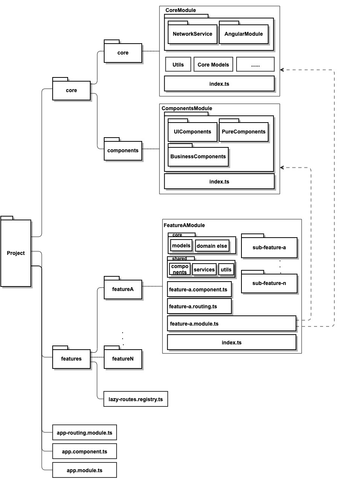

## Feature 架构规范

1. 必须依赖 **CoreModule** ，选择性依赖项目的 **ComponentsModule** 。
2. 拥有自己的 CoreModule 和 SharedModule，主要内容类似**CoreModule**和**ComponentsModule** ，但是关注点只是当前 Feature。
3. 内部可以依赖**CoreModule**和**ComponentsModule**。
4. 领域与领域之间 不存在相互依赖
5. feature 内部子 feature，如 sub-feature-a 其内部结构应与 featureA 一致。
6. feature 内部嵌套子 feature，原则上尽量不要超过 2 层。如 featureA::::sub-feature-a::::third-sub-feature-a-a

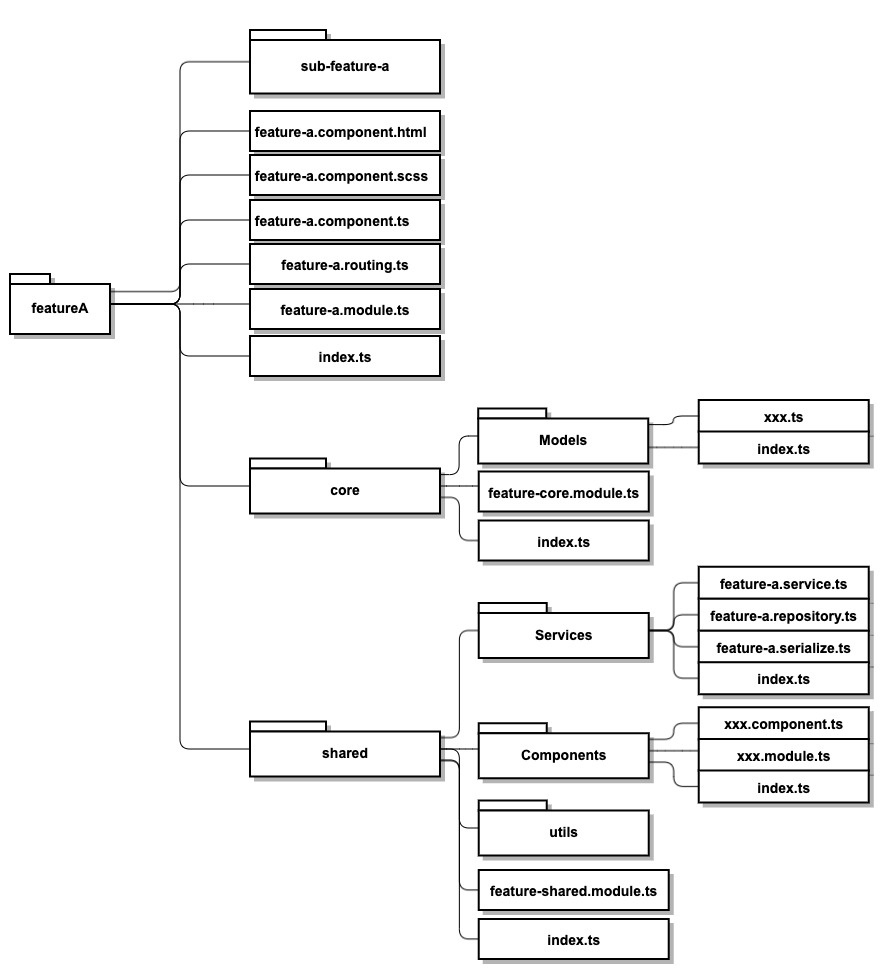

# 五、CLI 建设

运行监测

错误日志

- 手机用户浏览器的错误信息进行分析

性能数据

- 首屏时间
- pageLoad Time

性能优化

- CDN
- LazyLoading
- 组件优化

# 参考文档

- [咸鱼 Flutter https://github.com/alibaba/fish-redux](https://github.com/alibaba/fish-redux)
- [good-front-end-architecture](https://www.sitepoint.com/good-front-end-architecture/)
- [Angular 总体结构的指导原则](https://angular.cn/guide/styleguide#overall-structural-guidelines)
- [Atomic Design](https://bradfrost.com/blog/post/atomic-web-design/)
