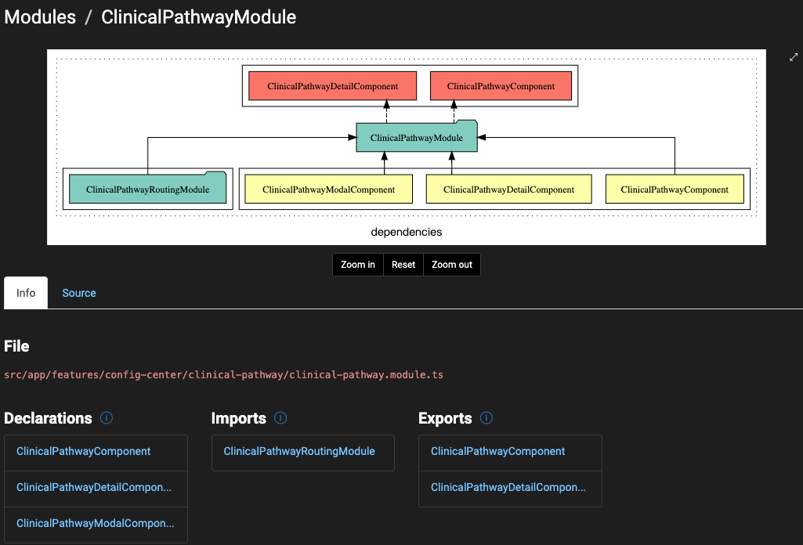
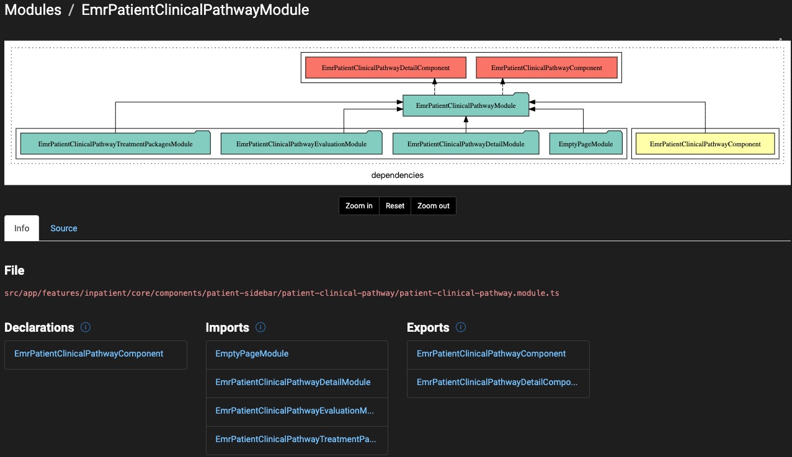
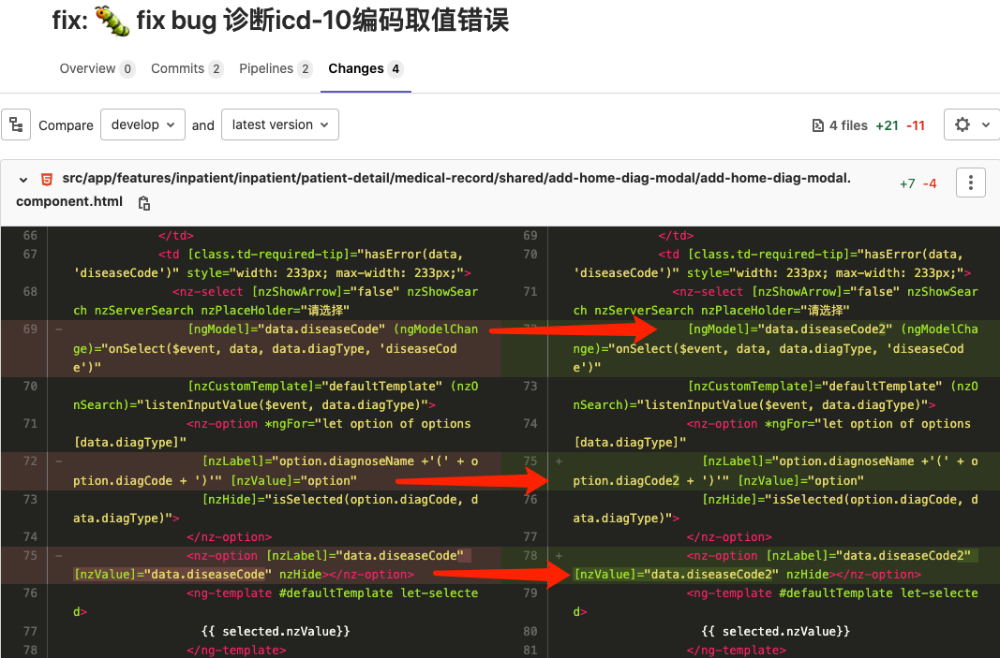
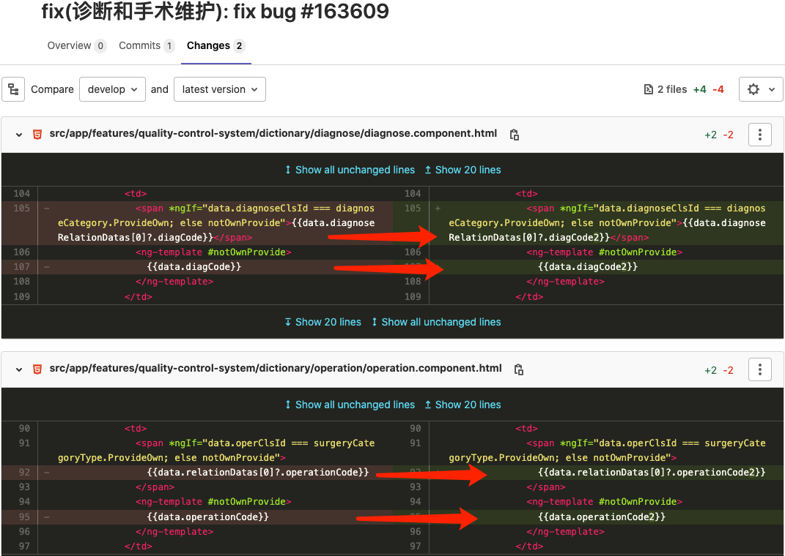
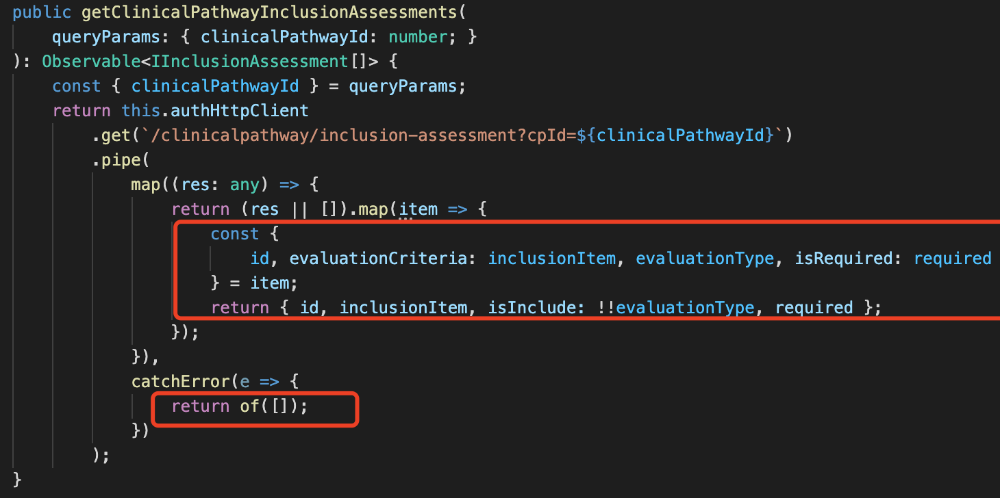
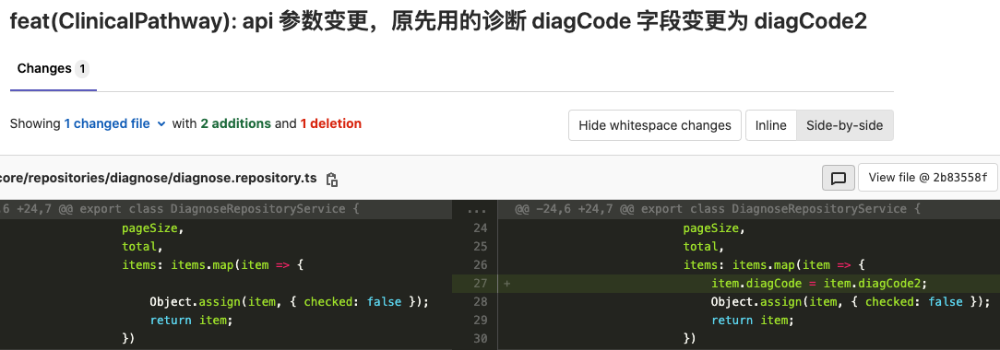

## 整体预览





## 重新理解四层架构

### 基础设施层

完成我们的数据持久化，以及对其他层提供通用的技术能力。层内部内容包括框架服务，如 HttpClient ，项目底层框架服务，如应用启动服务: StartupService, HTTP 拦截器: DefaultInterceptor, API 服务：AuthHttpClient 、系统权限服务: AuthPermissionService ，以及其它服务，基础库，这一层在系统构建之初搭建而成，后续我们直接调用即可。

### 领域层

也可以称之为模型层，负责表达业务概念，业务状态信息以及业务规划。EMR 现有文书领域、医嘱领域、医疗组领域、临床路径领域，领域内部聚焦领域对象分析，构建实体，领域服务，领域仓储，工厂等，对外暴露其领域抽象。它是领域的核心，这一层统一由领域 Owner 与领域专家沟通确认后的对真实世界的架构，领域 Owner 进行持续的维护/更新。

### 应用层

用例编排，定义模块或系统要完成的任务，指挥协调领域对象进行不同的操作，该层布设计业务领域知识。

### 表现层

用户界面的展现，负责 UI，UX 逻辑，展现数据，提交用户操作数据。

## 细拆分领域层

<table class="wrapped confluenceTable" resolved=""><colgroup><col><col><col><col></colgroup><tbody><tr><th class="confluenceTh">&nbsp;</th><th class="confluenceTh">描述</th><th colspan="1" class="confluenceTh">文件组织规范</th><th colspan="1" class="confluenceTh">文件说明</th></tr><tr><th class="confluenceTh"><h3 id="id-复杂领域模块规范-models"><span>models</span></h3></th><td class="confluenceTd"><span>领域模型</span></td><td colspan="1" class="confluenceTd">src/app/core/models/domain/</td><td colspan="1" class="confluenceTd">领域模型统一在domain/下管理，导出必要的属性</td></tr><tr><th class="highlight-grey confluenceTh" rowspan="3" data-highlight-colour="grey"><h3 id="id-复杂领域模块规范-repository"><span>repository</span></h3></th><td rowspan="3" class="confluenceTd"><ul><li><span>repository，领域仓库，与基础设施层关联</span></li><li>是前后端的防腐层，完成数据持久化</li></ul></td><td colspan="1" class="confluenceTd">src/app/core/repositories/domain/domain.repository.ts</td><td colspan="1" class="confluenceTd"><div><span style="color: rgb(51,51,51);">负责业务API CRUD，输出DTO或者interface，不做业务用例逻辑处理，注意与service的区别</span></div></td></tr><tr><td colspan="1" class="confluenceTd">src/app/core/repositories/domain/domain.serialize.ts</td><td colspan="1" class="confluenceTd"><div><span style="color: rgb(51,51,51);">建议数据的Normalize操作和Serialize操作都在Repository里完成，如果Serialize过程复杂度较高，建议新建Serialize文件处理</span></div></td></tr><tr><td colspan="1" class="confluenceTd"><span>src/app/core/repositories/domain/domain.typings.ts</span></td><td colspan="1" class="confluenceTd"><span style="color: rgb(51,51,51);">业务相关的typings声明</span></td></tr></tbody></table>

## repository 与 service 区别

Service 在四层架构里的应用层，职责在于用例编排，可以调用领域层完成其业务用例，关注点在于业务用例，不在于具体 API 等应用细节

Repository 负责完成数据的持久化处理，作为防腐层，输出标准的 DTO 或者领域 Interface，关注点在于数据处理。

- 数据原始数据经过 normalize 变成期望数据
- 期望的数据经过 deserialize 变成实体模型

### 示例 Service

#### clinical-diagnose.service.ts

```Typescript
public removeClinicalPathwayDiagnoseGroups(diagnose: IClinicalPathwayDiagnose): Observable<void> {
    if (diagnose.id) {
        const param = { clinicalPathwayId: this.clinicalPathway.id, diagnoseGroupId: diagnose.id };
        return this.clinicalPathwayRepository.deleteClinicalPathwayDiagnoses(param)
            .pipe(
                map(diagnoses => {
                    this.clinicalPathway.removeDiagnose(diagnose);
                    return diagnoses;
                })
            );
    }
    if (!diagnose.id) {
        return of(this.clinicalPathway.removeDiagnose(diagnose));
    }
}
```

#### patient-clinical-pathway-detail.service.ts

```Typescript
@Injectable({ providedIn: 'root' })
export class EmrPatientClinicalPathwayDetailService {
public pageInit(inpatCode: string, inpatId: number): Promise<ClinicalPathway> {
  return this.clinicalPathwayRepositoryService
    .getPatientClinicalPathwayExecutionSummary(inpatCode)
    .pipe(
      switchMap(res => {
        const clinicalPathwayExecution = new ClinicalPathway(res);
        return forkJoin([
          of(clinicalPathwayExecution),
          this.clinicalPathwayRepositoryService
            .getPatientClinicalPathwayExecutionTreatments(inpatCode)
        ]);
      }),
      map(res => {
        const [clinicalPathwayExecution, treatments] = res;
        clinicalPathwayExecution.setExecutionTreatments(treatments);
        this._patientClinicalPathwayService.updatePatientClinicalPathwayRelation(inpatId,
          clinicalPathwayExecution);
        this.clinicalPathwayExecution = clinicalPathwayExecution;
        return clinicalPathwayExecution;
      })
    )
    .toPromise();
}
}
```

#### patient-order.service.ts

```Typescript
// 调用方自行判断保存医嘱的病人和当前病人 inpatId 是否一致,这里一律按正常逻辑
// 新增医嘱与临床路径执行关联关系，在暂存操作时，add 临床路径执行的关联关系，在删除时， delete 临床路径执行的关联关系
// patientInfo.isClinicalPathway 患者进入路径标识， 路径的患者再调用路径外项目检查
public async saveOrderList(body: any): Promise<any> {
  const { res, ordersSucceedStoraged } = await this.storeOrdersToDataBase(body);

  if (ordersSucceedStoraged) {
    const isPatientRelatedWithClinicalPathway = await this.checkCurrentPatientClinicalPathwayRelation();
    if (isPatientRelatedWithClinicalPathway || this.patientInfo.isClinicalPathway) {
      await this.updateOrderProjectsWithClinicalPathway(body, res);
      this._patientClinicalPathwayService.refreshTreatmentProjects$.next(true);
    }
  }
  return res;
}
```

### 示例 Repository

#### clinical-pathway.repository.ts

```Typescript
// 删除 临床路径信息（再审核）
public delClinicalPathWay(clinicalPathwayId: number): Observable<void> {
  return this.authHttpClient
    .delete(`/clinicalpathway/clinical-pathway-info/${clinicalPathwayId}`)
    .pipe(
       map((res) => res),
       catchError(e => {
        return of({ code: 0, data: null, message: '删除失败' });
       })
    );
}
```

--

## repository 仓库的数据处理

### 防腐层

#### 腐烂示例




#### 防腐烂示例



