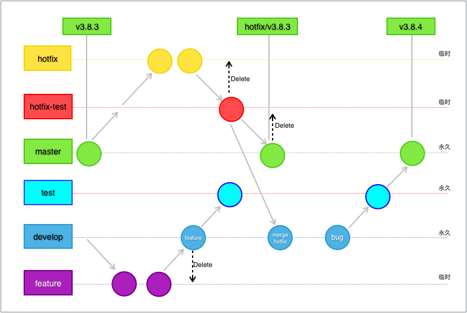

# GIT 分支策略

## 目前项目开发使用 git flow 开发流程,结合 gitlab 的 Merge Request 的 code review

## Git-flow 分支介绍

### master

【线上的分支】 - 是线上版本分支，也可以理解为随时可以发布的稳定版本，要求在每次版本封版后由主程序员合并`release`分支代码进来，开发人员不可以随意操作或者每次 hotfix 之后进行合并。该分支被保护，所有合并必须通过 github 的 pr 功能 经过 codereivew 和质量门控制之后进行合并。

### dev/develop

【开发集成分支】 - 包含待上线的新内容，是所有开发团队合并新功能的分支，那些功能都是经过独立测试的，只是未集成到统一进行测试。该分支也汇集所有已经完成的功能，并等待经过`release`分支测试通过后最终被整合到 `master` 分支中。 该分支在 sprint 末期会发布提测到 147 集成测试环境。

### release

【上线分支】 - 当开发结束后用来提测并且为本次版本最终上线的分支，所有集成测试阶段的 bug 全部在此分支修复，测试结束后合并到 `master` 和 `dev`分支中。在该分支上不要再开发新功能

当准备将 develop 上的新内容发布到生产环境时，需要拉 release 分支。release 分支可以隔离 dev 后续对本次上线的影响。当 release 拉出来后，不用担心其它的东西会合过来，只需要在这上面专注测试和修复 bug。

### feature

【新功能开发分支】 - 开发新功能时以团队的 dev 分支为基础建立新的 feature 分支进行单独开发。当需要此功能的时候，只需要将该 `feature` 分支合并入 `dev` 分支，下次一并提测即可。

这样设计可以避免这个功能在尚未开发完成或者通过测试的时候混入发布的版本，而导致不可预知的不稳定。当然也可以同时开启多个 `feature` 分支进行不同新功能开发，在合适的时候合并提测即可。

### hotfix

【线上紧急 bug 分支】 - 用来修复线上的紧急 bug，应由 `master` 拉出，并在修复完成后合并入 `master` 和 `dev`保证两分支的 bug 已修复。

修复 Issue 时，commit 消息请遵循

```
This commit refs #1, #2
```

```
This commit fixes #3
```

## 常见的场景和操作规范

### 开发新功能

1.  从`dev`拉一个`feature`分支。
2.  在`feature`分支上做开发。
3.  `feature`开发完成后，需要提交测试，

    有两种场景：

    一种是该 feature 功能不复杂，测试点不多，自测充分后可以直接完成`feature`；

    另一种是`feature`功能非常复杂，测试点也很多。这个时候不要马上完成`feature`，前期让 QA 直接在`feature`分支上测试，等测得比较稳定后再完成`feature`。因为功能复杂的 feature，自测完成后肯定还是有很多问题，过早合到`dev`，`dev`将有很长一段时间不能上线，会影响到其它的发布。

4.  完成`feature`将`feature`分支合并到`dev`，删除原分支。

### 上线

- `团队dev`会不断累积新内容等待上线，团队 dev 每完成一个功能可以合并回集成 dev
- 上线时，准备一个`release`分支，准备`release`分支时需要搞清楚这次上线新增的内容，列给 QA，让 QA 有针对性的测试。
- 在打包机器上打包对应的`release`分支，部署到应用服务器让 QA 测试，发现 bug 直接在`release`上修改。
- `release`测试通过后，可以上线了，则将` release合并``dev `。
- 合并到``` master 通过 gitlab的 Merge Request 功能提交申请 ，通过合并后`  删除该`release`分支`` ```
- 线上部署的时候，从`master`打一个包，先部署到预发或者生产测试环境，在预发上简单回归测试，没问题后发布到线上服务器，上线完成。

### 紧急修复

- 对于一些需要马上修改并尽快上线的内容，走`hotfix`分支。
- 从最新的`master`拉`hotfix`分支并在`hotfix`分支上修改。
- 在打包机器上打包对应的`hotfix`分支，部署到应用服务器给 QA 测试，发现 bug 直接在`hotfix`分支上修改。
- `hotfix`测试通过后，可以上线了，则将` hotfix合并``dev `，
- 合并到`master通过 Merge Request  提交申请 ，通过合并后` 删除该`hotfix`原分支，master 分支打上 TAG。

### 一些注意事项

- 每一个流程完成后一定要记得合代码和推代码，不然会坑到后面的人。
- 及时在群里同步信息。
- `release`分支最好一天不超过一个，如果需要上线多次，可以合并到一起。
- 提交分支前记得`pull`新代码，pull 操作使用 git pull --rebase
- 禁止使用 git push -f 提交代码
- 当我们想要对上一次的提交进行修改时，代码没有 push 远程之前，我们可以使用 git commit –amend 命令
- 如果出现某个 bug 你在 dev 修复了，但是又想在 master 上修复 ，可以使用 git cherry-pick 提取 commit
- 对于目前这套流程，原有 git flow 工具 操作的时候 注意 git flow feature start feature01 dev_cell1 (要特定指定基于哪个分支开发)，hotfix 流程 不能直接使用 git flow hotfix 因为脚本无法产生 PR

---

### git 交互式学习教程

[https://learngitbranching.js.org/?demo=&locale=zh_CN](https://learngitbranching.js.org/?demo=&locale=zh_CN)

### git flow 脚本工具集介绍

操作技巧

- [https://www.git-tower.com/learn/git/ebook/cn/command-line/advanced-topics/git-flow](https://www.git-tower.com/learn/git/ebook/cn/command-line/advanced-topics/git-flow)
- [https://github.com/petervanderdoes/gitflow-avh](https://github.com/petervanderdoes/gitflow-avh)
- [https://danielkummer.github.io/git-flow-cheatsheet/index.zh_CN.html](https://danielkummer.github.io/git-flow-cheatsheet/index.zh_CN.html)

### Bank 版本 Git 策略

feature

> 当需求复杂度>3 或者需求需要前后端联调时，feature 分支需要另开 feature-test 分支 ，确保自测以及测试在 feature-test 分支上测试通过后再合并 develop 分支，test 分支用来给 QA 进行针对性的测试。


