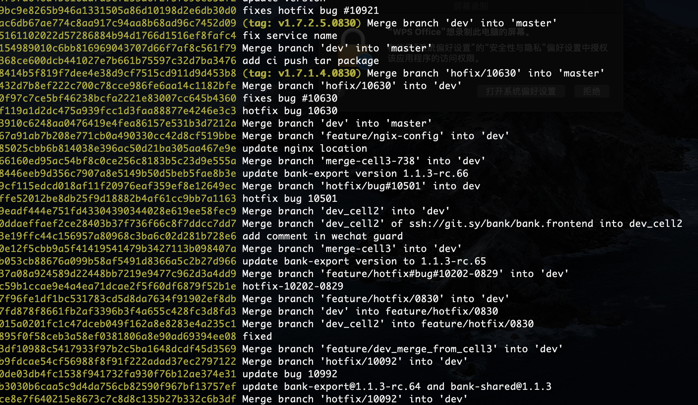

##   一、前言

Git 每次提交代码，都要写 Commit message（提交说明），否则就不允许提交。但是，一般来说，commit message 应该清晰明了，说明本次提交的目的。

现阶段，自由发挥状态下的 message 可以说是风格各异的，而通过标准格式约束，message 更加容易分析，两者对比如下：

|               Before               |               After               |
| :--------------------------------: | :-------------------------------: |
|  |  |

良好的 commit 信息，帮助我们生成良好的 CHANGELOG，如下


## 二、Git commit message 规范化的意义

- 可读性高，不必深入看代码即可了解当前 commit 的作用。
- 为 Code Reviewing 做准备
- 方便跟踪工程历史
- 让其他的开发者在运行 git blame 的时候想跪谢
- 可以直接生成 CHANGELOG
- 提高项目的整体质量，提高个人工程素质

## 三、Git commit message 规范

每次提交，Commit message 都包括三个部分：header(必需)，body(可选) 和 footer(可选)。

> 基本 commit 示例
> feat: refes [#8](http://git.sy/platform-public/sy-ng-zorro-antd/issues/8)  完成导航菜单-导航模式
>
> fix: remove broken link from docs
>
> fix(service): log error when file loading or preprocessing fails

<p style="margin-left: 36.0pt;"><span style="color: rgb(0,0,255);">HEADER&nbsp; &nbsp; &lt;type&gt;(&lt;scope&gt;): &lt;subject&gt;</span></p>
<p style="margin-left: 36.0pt;"><span style="color: rgb(0,0,255);">&nbsp; &nbsp; &nbsp; &nbsp; &nbsp; &nbsp; &nbsp; &nbsp; &nbsp; &nbsp;&lt;BLANK LINE&gt;</span></p>
<p style="margin-left: 36.0pt;"><span style="color: rgb(0,0,255);">BODY&nbsp; &nbsp; &nbsp; &nbsp; &nbsp;&lt;body&gt;</span></p>
<p style="margin-left: 36.0pt;"><span style="color: rgb(0,0,255);">&nbsp; &nbsp; &nbsp; &nbsp; &nbsp; &nbsp; &nbsp; &nbsp; &nbsp; &nbsp;&lt;BLANK LINE&gt;</span></p>
<p style="margin-left: 36.0pt;"><span style="color: rgb(0,0,255);">FOOTER&nbsp; &nbsp; &lt;footer&gt;</span></p>

**HEADER**

**Header 部分只有一行，包括三个字段：`type`（必需）、`scope`（可选）和`subject`（必需）**

### Type

- `feat:`      新功能（feature
- `fix:`      修补 bug（推荐：带上 bug 号
- `style:`    格式（不影响代码运行的变动）
- `refactor:`  重构（即不是新增功能，也不是修改 bug 的代码变动）
- `test:`      测试相关代码变动
- `chore:`    构建过程或辅助工具的变动
- `docs:`     文档（documentation）
- `build:`     构建过程属于外部依赖部分的修改，如 CI
- `revert:`    撤销某次提交

### Scope

- `service:`  service range，常见场景: 修改了 API 名称或- `参数
- `repository:` repository range，常见场景: 修改数据 序- `列化或反序列化
- `model:`      model range，常见场景: 业务变更或业务 bug
- `view:` view or viewModel range，常见场景: 页面 UI 元素变更
- `shareModule:` shared module range
- `coreModule:`  base module range
- `\*: ` global range

### Subject

- 简短描述，不超过 50 个字符。以动词开头，使用第一人称现在时，比如 change，而不是 changed 或 changes,
- 第一个字母小写,结尾不加句号（.）

**BODY**

body  部分是对本次 commit 的详细描述，可以分成多行。下面是一个范例。

```
More detailed explanatory text, if necessary.  Wrap it to
about 72 characters or so. 
```

> 使用第一人称现在时，比如使用 change 而不是 changed 或 changes。
> 应该说明代码变动的动机，以及与以前行为的对比。

**Footer**

Footer 部分描述更新或关闭了特定任务或 Issure  
如 ： update #123  closes #234

### Revert

如果当前 commit 用于撤销以前的 commit，则必须以 revert:开头，后面跟着被撤销 Commit 的 Header。

```C#
revert: feat(pencil): add 'graphiteWidth' option

This reverts commit 667ecc1654a317a13331b17617d973392f415f02.
```

Body 部分的格式是固定的，必须写成`This reverts commit &lt;hash>`.，其中的 hash 是被撤销 commit 的 SHA 标识符。

如果当前 commit 与被撤销的 commit，在同一个发布（release）里面，那么它们都不会出现在 Change log 里面。如果两者在不同的发布，那么当前 commit，会出现在 Change log 的 Reverts 小标题下面。

## 四、参考

git commit 规范

[https://www.ruanyifeng.com/blog/2016/01/commit_message_change_log.html](https://www.ruanyifeng.com/blog/2016/01/commit_message_change_log.html)

[https://segmentfault.com/a/1190000009048911](https://segmentfault.com/a/1190000009048911)

git commit 工具

[https://www.npmjs.com/package/commitizen](https://www.npmjs.com/package/commitizen)
