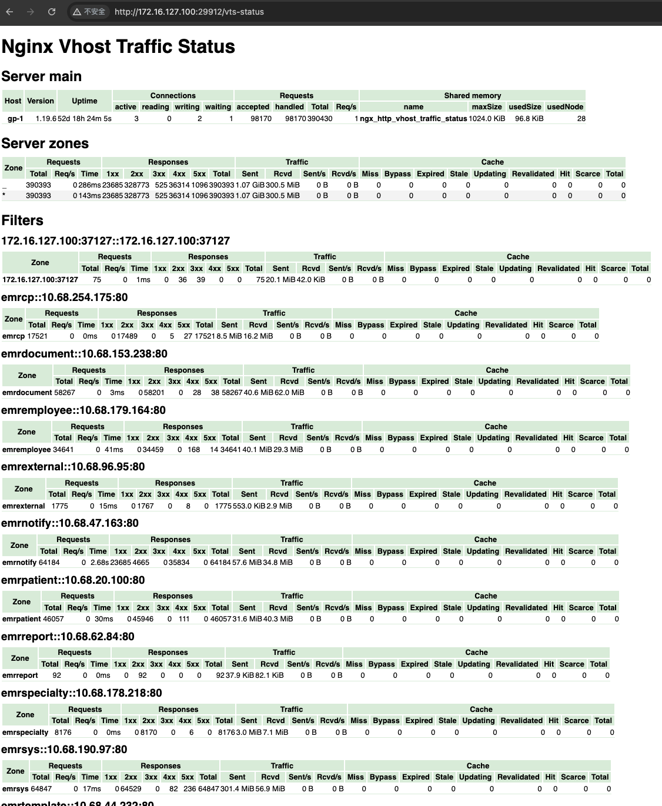

# Nginx 常用配置指南

---

## VTS module 配置

```nginx
http {
    server_tokens off;
     include /etc/nginx/mime.types;
     default_type application/octet-stream;

    vhost_traffic_status_zone;
     vhost_traffic_status_histogram_buckets 0.005 0.01 0.05 0.1 0.5 1 5 10;
     vhost_traffic_status_filter_by_set_key $proxy_host $proxy_host::$upstream_addr;
}


server {
    location /vts-status {
        vhost_traffic_status_bypass_stats on;
        vhost_traffic_status_display;
        vhost_traffic_status_display_format html;
    }
}
```


