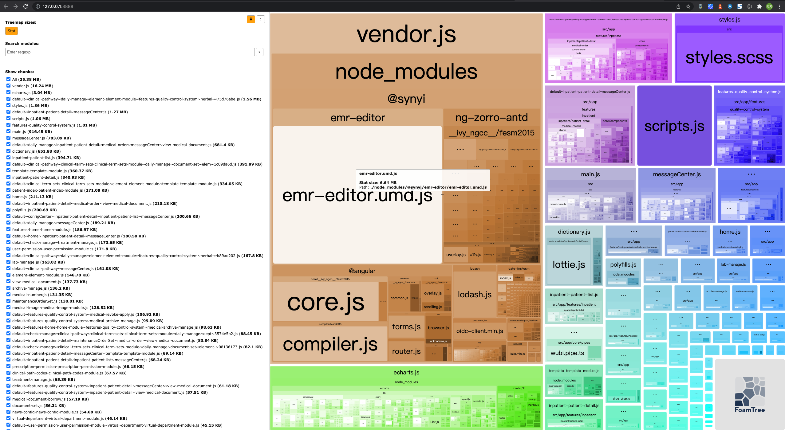

# webpack Bundle Analyzer 学习

## 安装

```bash
# NPM
npm install --save-dev webpack-bundle-analyzer
# Yarn
yarn add -D webpack-bundle-analyzer
```

## 配置 Angular 项目执行脚本，构建协同输出 stats.json

package.json npm 脚本里新增 build 脚本

```json
"scripts": {
  "ng": "ng",
  "start": "ng serve",
  "build": "ng build",
  "build:stats": "ng build --stats-json"
}
```

## 构建 Angular

`npm run build:stats`

## 分析 bundle 包

```json
"scripts": {
  "ng": "ng",
  "start": "ng serve",
  "build": "ng build",
  "build:stats": "ng build --stats-json",
  "analyze": "webpack-bundle-analyzer dist/angular-bundle-analyzer-example/stats.json"
}
```

执行 `npm run analyze`

我们可以看到控制台输出

```bash
Webpack Bundle Analyzer is started at http://127.0.0.1:8888

Use Ctrl+C to close it
```

关注分析报告，我们可以看到 bundle 分析，这份报告陈列了整体项目 bundle size 占比，可以聚焦具体 bundle 查看内部占比，帮助我们分析，尝试做出举措来 reduce the project size。


