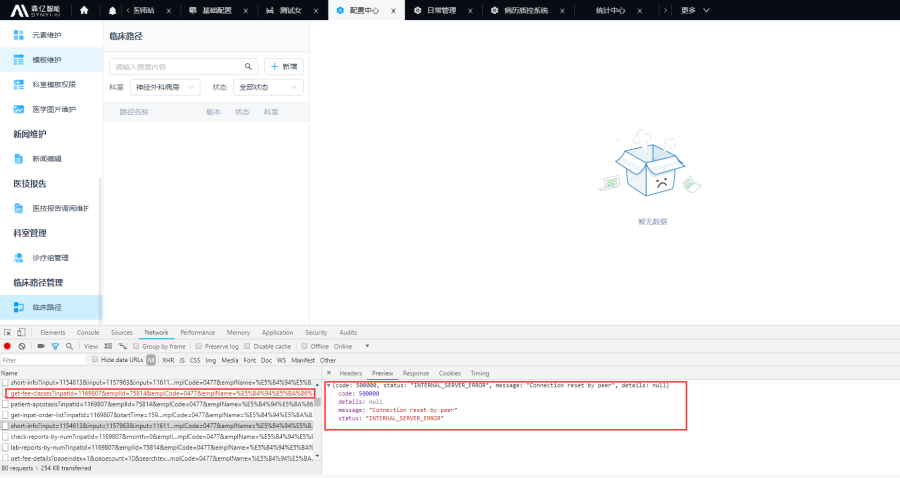
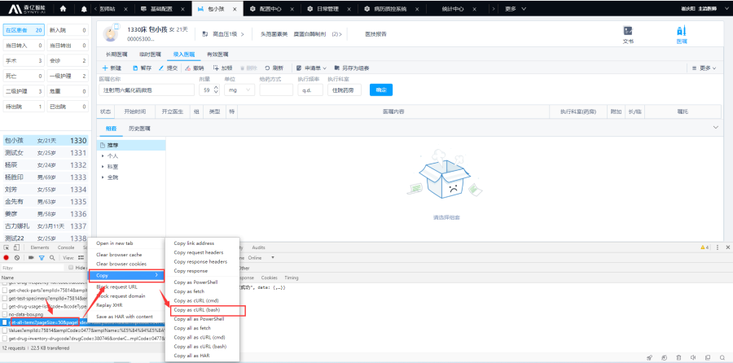
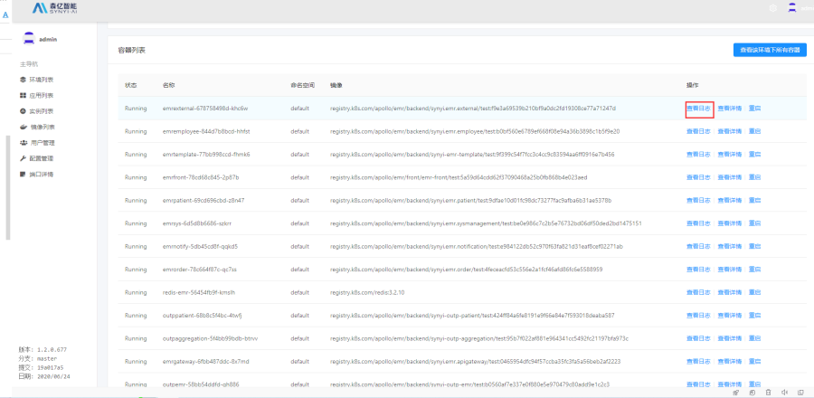
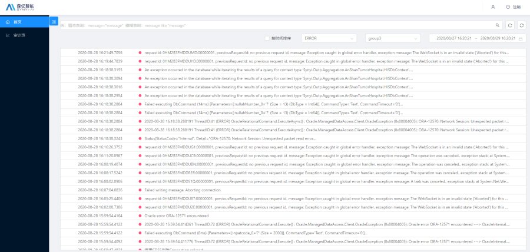

# 日志查看

程序运行中查看日志是定位排错的有效办法。日志可以分为前端报错信息和后端 docker 日志，后端 seq 日志几类。

- **前端日志查看**

Chrome 接口数据保存

[HAR（HTTP 归档）](https://www.google.com/url?q=http://www.softwareishard.com/har/viewer/)  是多种 http 会话工具用来导出所记录数据的一种文件格式。 这种格式基本上是 JSON 对象，并具有特定的字段 分布。 在任何情况下，都请注意并非所有字段都是必填字段。 很多时候，部分信息不会保存到文件中。

您可以使用 F12 出现的“开发者工具”中的“Network”（网络）标签 记录 HTTP 会话。

- 在菜单中打开“开发者工具”（“菜单”>“工具”> “开发者工具”），您也可以在键盘上按 Ctrl+Shift+C
- 点击“Network”（网络）标签
- 在“Network”（网络）标签的左上角，找到一个圆形按钮。 确保该按钮是红色的。如果显示灰色，请点击一次以开始 记录。
- 选中“Preserve Log”（保留日志）旁边的复选框。
- 您可以先使用“Clear”（清除）按钮（含有对角线的圆圈） 然后立即尝试重现 问题，以便移除不需要的标头信息
- 重现问题
- 要保存记录的内容，请在网格上点击右键，然后选择 “Save as HAR with Content”（将内容保存为 HAR）

后端开发人员需要使用 HAR viewer

[https://chrome.google.com/webstore/detail/http-archive-viewer/ebbdbdmhegaoooipfnjikefdpeoaidml/related](https://chrome.google.com/webstore/detail/http-archive-viewer/ebbdbdmhegaoooipfnjikefdpeoaidml/related)

可以解析查看内容。

- **Seq 日志查看技巧**

seq 包含几个区域 一开始输入框 可以输入关键词搜索，输入框下有时间区域选择缩短时间段，右侧是 分类区，可以直接查看异常 或者预先配置好的条件的日志

查看某个程序的日志：在某一条日志的详情中点击 Application 字段（如果出现了的话）的对号，选择 Add to Signals 既可加入右侧区域，后续在右侧都可以查看。Application 可以用于区分某一类日志

查看某个请求的日志：在某一条日志的详情中点击 RequestId 字段（如果出现了的话）的对号，选择 Find，就可以查看这个请求的所有日志

查看某个报错的日志：日志特别多的情况下，可以在 Chrome F12 开发者工具 Network 中右键某个报错请求进行 Replay，之后立刻去查看是哪里报错。注意这种最好不要用于操作类的接口报错，读取类的接口可以。

- **docker 日志**

docker logs 容器名   -ft  \--tail=1000 显示最近的 1000 条日志

kubectl logs   容器名  \--tail=1000  在 k8s 集群环境

如果想要把这个段日志导在命令加个重定向   docker logs 容器名     \--tail=1000 > 文件 1.log

## 排查报错的请求

如果业务出现问题，要先排除是否有报错的请求，以及报错的内容，我们可以通过以下操作来排查是否有对应的报错：

- 按 F12 打开开发人员工具
- 选择 Network Tab 页面
- 操作界面，排查有没显示红色的请求，如下图所示
- 点击请求，可以查看到报错的信息

## 现场数据请求抓取（cURL）

如果现场业务出现问题，或者开发需要现场请求分析，现场人员可以进行以下操作来抓取对应的请求 cURL：

- 按 F12 打开开发人员工具
- 选择 Network Tab 页面
- 操作界面，抓取到对应的请求
- 右键请求，复制对应的 cURL，如图所示

## Server-Manager 日志查看（部署相关日志）

登录 Server-Manager 平台，然后点击"实例列表"》找到对应点服务点击"查看详情"》找到容器列表，点击"查看日志"，就可以看到运行相关日志。  
设计到**部署、容器及容器状态**的相关日志可在此处查看。  

## SynyiLogging 日志查看（业务相关日志）

登录部署的日志平台，然后进行查看，提供分类、关键字查询。  
**业务**运行的相关日志都在此处查看。  

