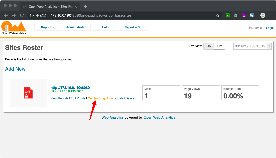
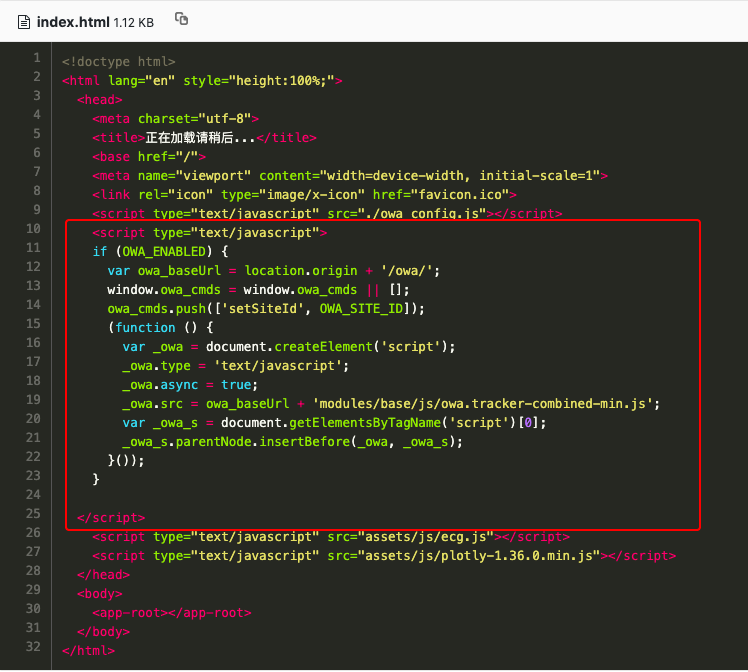
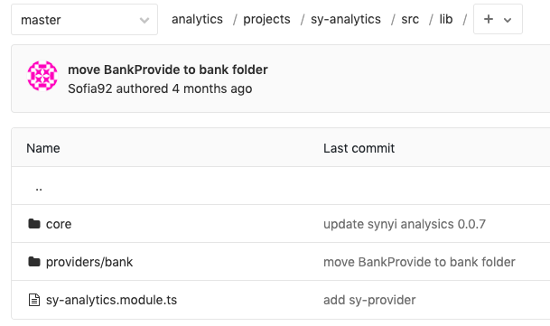
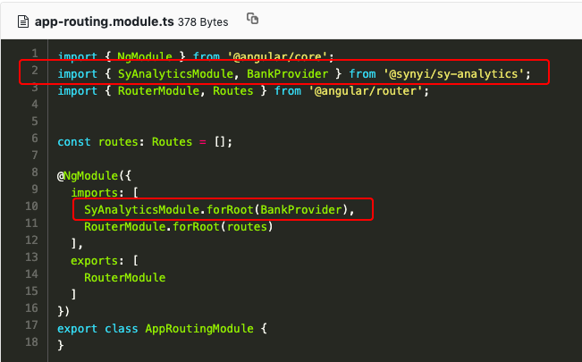
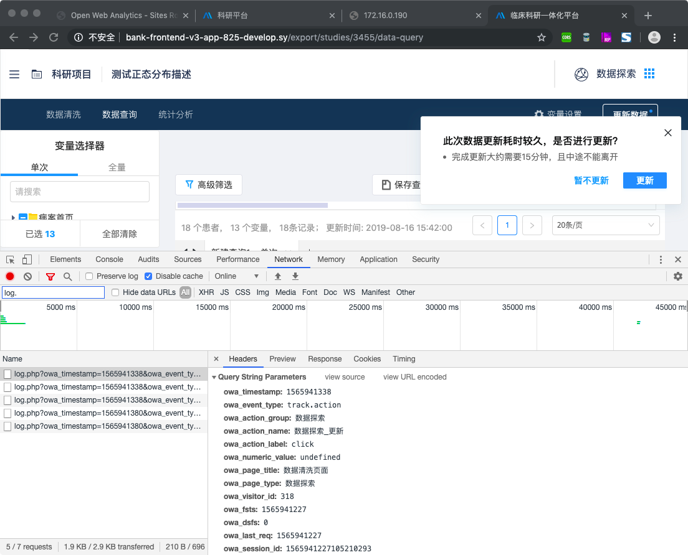
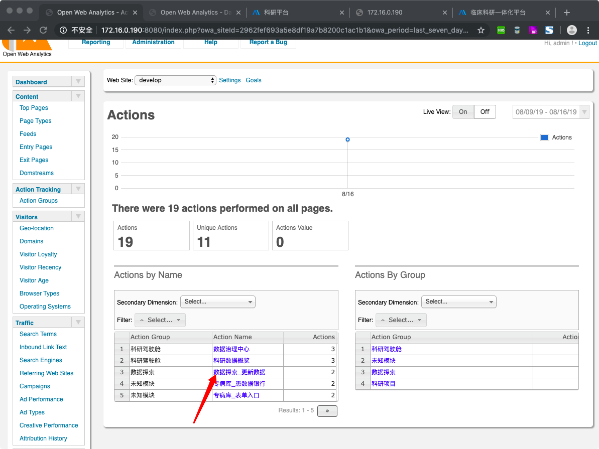
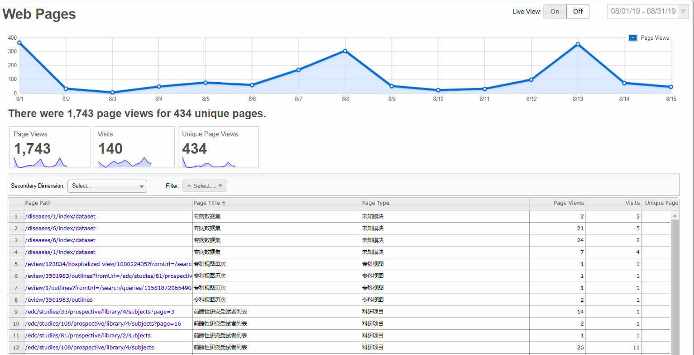

## 场景

对 bank 系统进行数据埋点，分为按钮点击、页面 PV 和停留时长 2 个部分

## 框架选型：Open Web Analytics

官网：[http://www.openwebanalytics.com/](http://www.openwebanalytics.com/)

官方 Demo: [http://demo.openwebanalytics.com/owa/index.php](http://www.openwebanalytics.com/owa/index.php)

github 地址： [Open Web Analytics](https://github.com/padams/Open-Web-Analytics)

OWA Wiki：[https://github.com/padams/Open-Web-Analytics/wiki](https://github.com/padams/Open-Web-Analytics/wiki)

## OWA 实现通用库：SyAnalytics

gitlab 地址：[http://git.sy/bank/bank-dev/analytics](http://git.sy/bank/bank-dev/analytics)

## 项目中引用方法

#### 登录 OWA 管理系统

#### step1: 新建站点

#### step2: get and set trcker code

找到上述 Javascript 代码，复制到 你的项目，index.html 文件中，至此，你已经成功在项目中添加好了 tracker code。

#### step3: 扩展 Provider

core 文件是抽象好的 OWA 实现，封装了 SyAnalyticsServerProviderService。

项目对接的方式就是 参考 providers/bank，新建 provider 来实现 SyAnalyticsServerProviderService。比如 BankProvider 比如 EMRProvider etc。

#### step4: 项目对接

在你项目的跟模块的 app.module.ts 文件内注入 SyAnalyticsModule.forRoot(BankProvider) || SyAnalyticsModule.forRoot(XXProvider)

在想要记录的地方添加 tracker 指令：syAnalytics

比如，想要在页面上记录跟踪，更新按钮，那我们在业务代码 更新按钮 处增加指令即可

`syAnalytics \[syAnalyticsNodeName\]="'数据探索\_更新'"`

#### step5: 验证，是否埋点数据进行了追踪

当我们在埋点位置点击操作时，看到开发者工具 Network 中发送了 log 记录，点开查看 log 详细信息，如上图所示则表示前面所有步骤都正确的执行了。

登录 OWA 管理系统，我们可以看到，刚刚点击的事件已经如我们预期的捕捉到了，至此，恭喜你，埋点成功～～～。

#### 附

OWA 默认记录的信息都是原信息，即页面记录的是 URL 等不够语意化，bank 的方案是在 bank provider 里维护了一套 mapping 关系。其它 provider 也可以参考维护一份。

