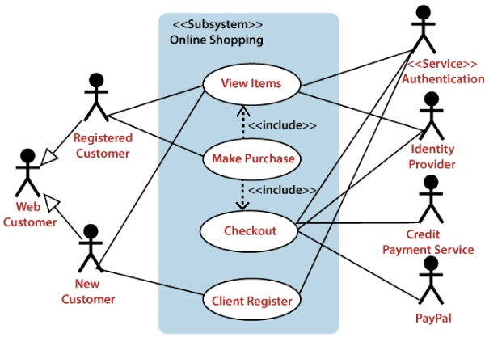
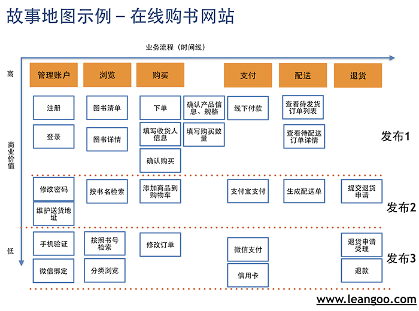
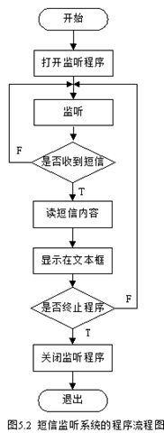
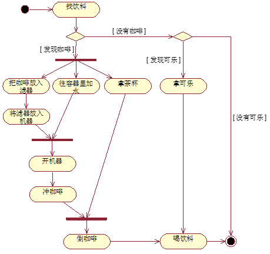
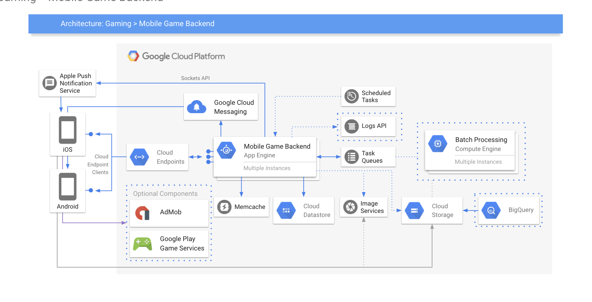
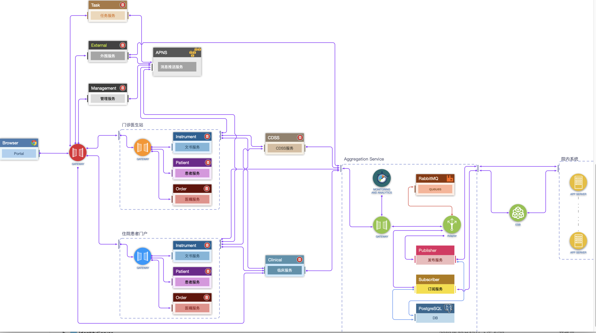

为了规范工程质量，标准化研发项目交付物。工作组制定一整套文档规范与设计规约，确定贯穿整个研发流程需要确保的文档产生物，并为这些文档提供足够的实践指导。

我们将按照软件设计流程的六个阶段（需求分析、概要设计、详细设计、编码、测试、交付），选择研发人员需要重点关注的三个环节：概要设计、详细设计与交付，确认其中的文档交付物，并对于文档以及图例的书写进行规范。

# 1\. 项目立项与需求分析

在这个阶段，产品经理、研发经理、项目经理、架构师、研发人员等角色都会参与到立项这一环节中，同时会开展软件产品需求的分析与梳理工作（一般主要由产品经理负责）。

对于一些例外情况，比如项目团队比较精悍，需求分析可能由开发人员简单负责，为了能够项目交付物的标准化，**开发人员也需要撰写简易的需求文档**，即便不写需求文档，也需要撰写 README 性质的项目介绍文档，以确保必要信息不会丢失。

撰写的文档交付物至少需要涵盖以下几个方面：

## 1.1 产品介绍与用户角色

简要概述产品并且介绍产品的目标用户，若目标用户分为多角色则介绍分为哪几类角色，对应的几个角色对于产品有什么不同需求。

## 1.2 功能描述

介绍本产品需要实现的功能，解决了用户什么需求。产品根据业务场景分为几个功能模块，每个模块又有哪些功能特性。

通常这一环节都是由产品经理负责，包括在这个环节中产出原型图以详细描述需求的实现。

由开发人员承担的情况下这一环节我们认为可以简化。

### 1.2.1 思维导图

我们建议，**在与系统交互的用户角色仅有一个且相关的用户用例（Use Case）超过 5 个**，可以使用**思维导图**描述产品的功能特性以及对应的功能层次，包括涵盖一些简单的业务流程等：

通过思维导图可以展示产品的功能层次，具体的功能描述可以通过多个思维导图聚焦于不同的功能特性进一步细化。

### 1.2.2 UML 用例图

对于**与系统交互的用户角色超过一个且相关的用户用例（Use Case）超过 5 个的场景，**建议使用 **UML 实例图**  来描述多角色之间与用例的关系：

有关 UML 用例图可以参考：

- [http://www.woshipm.com/pd/2602941.html](http://www.woshipm.com/pd/2602941.html)
- [https://zhuanlan.zhihu.com/p/149069217](https://zhuanlan.zhihu.com/p/149069217)

### 1.2.3 用户故事地图

此外，如果遵循敏捷开发，功能需求与业务流程也可以借助**用户故事地图**进行描述：

如何构建用户故事地图可以参考：[http://www.woshipm.com/pd/270289.html](http://www.woshipm.com/pd/270289.html)

## 1.3 业务流程

即描述产品中几个主要业务场景下的用户使用产品实现需求的流程。

在简易场景下，我们仍然可以用**思维导图**与**用户故事地图**描述产品的核心流程。

### 1.3.1 流程图 与 UML 活动图

如果要表示业务流程，最直观有效的方式就是针对一个流程绘制流程图：

绘制流程图参考：[https://zhuanlan.zhihu.com/p/149299710](https://zhuanlan.zhihu.com/p/149299710)

进一步地，如果业务流程相对较为复杂，可以绘制 UML 活动图描述

绘制 UML 活动图参考：[https://zhuanlan.zhihu.com/p/149079804](https://zhuanlan.zhihu.com/p/149079804)

### 1.3.2 泳道图

[https://zhuanlan.zhihu.com/p/149189258](https://zhuanlan.zhihu.com/p/149189258)

## 1.4 文档交付物

综上，在项目立项和需求分析阶段，产品需求文档

- 功能描述 & 业务流程 - 思维导图
- 功能描述 - 用例图
- 功能描述 & 业务流程 - 用户故事地图
- 业务流程 - 流程图 & UML 活动图

# 2\. 概要设计

## 2.1 统一言语与术语（Ubiquitous Language & Glossary）

统一语言是 DDD 领域驱动开发（Domain-Driven Language）的概念，目的是让业务团队与开发团队之间构建一个技术上与业务上共通的术语集，降低沟通成本。

因此需要列出项目中一些技术上与业务上容易混淆的重要概念，避免沟通上的误会。

同时，文档中需要对于产品中涉及到的业务概念的定义进行说明，并且**规定其英文名称**以规范化实际开发过程中的命名。

## 2.2 基础设施架构图

涉及到硬件层次相关的基础设施设计

建议遵循 Google Cloud Platform 基础设施架构绘图规范：[https://docs.google.com/presentation/d/1vjm5YdmOH5LrubFhHf1vlqW2O9Z2UqdWA8biN3e8K5U/edit#slide=id.p39](https://docs.google.com/presentation/d/1vjm5YdmOH5LrubFhHf1vlqW2O9Z2UqdWA8biN3e8K5U/edit#slide=id.p39)

## 2.3 微服务软件架构图

# 3.详细设计

## 3.1 UML 类图

## 3.2 数据模型（数据库 Schema 设计）

## 3.3 数据流图 & 业务流程图（？）

## 3.4 时序图

## 3.5 源码流程图

# 4\. 项目管理

## 4.1 甘特图

# 5\. 测试交付

## 5.1 API 文档

## 5.2 用户手册 & 集成文档

[https://github.com/ruanyf/document-style-guide/blob/master/docs/structure.md](https://github.com/ruanyf/document-style-guide/blob/master/docs/structure.md)

- 简介（Introduction）： \[必备\] \[文件\] 提供对产品和文档本身的总体的、扼要的说明
- 快速上手（Getting Started）：\[可选\] \[文件\] 如何最快速地使用产品
- 入门篇（Basics）： \[必备\] \[目录\] 又称”使用篇“，提供初级的使用教程
  - 环境准备（Prerequisite）：\[必备\] \[文件\] 软件使用需要满足的前置条件
  - 安装（Installation）：\[可选\] \[文件\] 软件的安装方法
  - 设置（Configuration）：\[必备\] \[文件\] 软件的设置
- 进阶篇（Advanced)：\[可选\] \[目录\] 又称”开发篇“，提供中高级的开发教程
- API（Reference）：\[可选\] \[目录|文件\] 软件 API 的逐一介绍
- FAQ：\[可选\] \[文件\] 常见问题解答
- 附录（Appendix）：\[可选\] \[目录\] 不属于教程本身、但对阅读教程有帮助的内容
  - Glossary：\[可选\] \[文件\] 名词解释
  - Recipes：\[可选\] \[文件\] 最佳实践
  - Troubleshooting：\[可选\] \[文件\] 故障处理
  - ChangeLog：\[可选\] \[文件\] 版本说明
  - Feedback：\[可选\] \[文件\] 反馈方式

## 5.3 部署手册

## 5.4 Troubleshooting & FAQ

## 5.5 Changelog & ReleaseNote

# 6\. 绘图工具推荐
