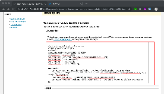
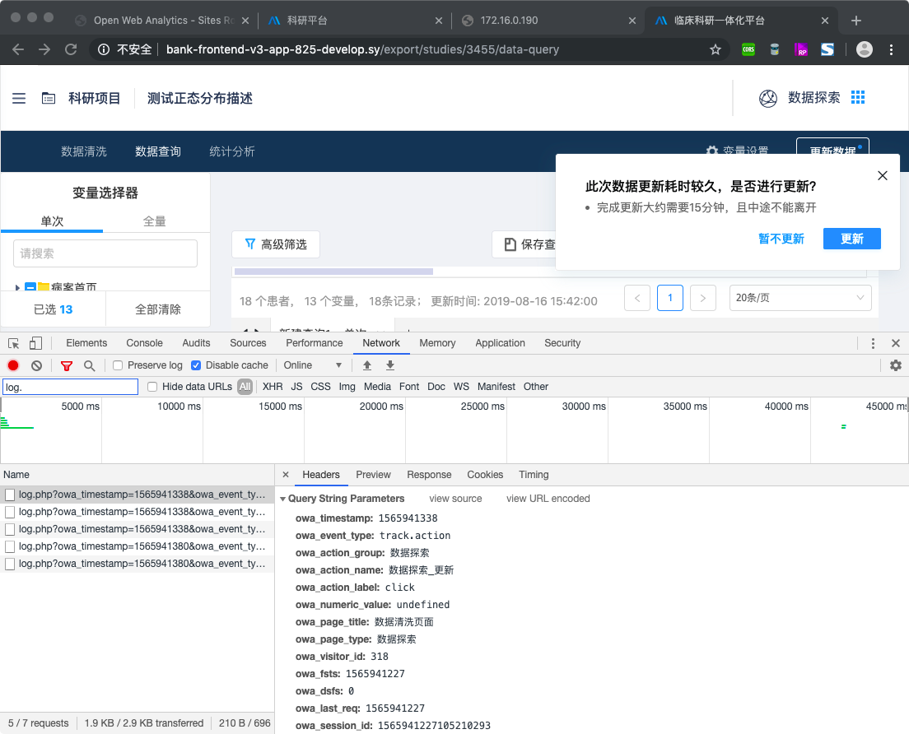

# 用户行为分析方案实施指南（OWA 集成版）

## 业务场景

面向业务系统实现用户行为数据采集，核心监测指标包含：

- 交互事件：按钮点击、表单提交等关键操作
- 页面指标：PV（页面浏览量）、停留时长等基础维度
- 转化路径：用户关键操作流程追踪

## 技术方案选型

### 核心框架：Open Web Analytics (OWA)

- **技术特性**：开源可定制、支持私有化部署、提供完整数据采集与分析套件
- **官方资源**：
  - 官网：[http://www.openwebanalytics.com](http://www.openwebanalytics.com)
  - GitHub 仓库：[Open Web Analytics](https://github.com/padams/Open-Web-Analytics)
  - 文档中心：[OWA Wiki](https://github.com/padams/Open-Web-Analytics/wiki)

### 企业级封装库：SyAnalytics

- **定位**：基于 OWA 二次开发的标准化埋点 SDK
- **功能特性**：
  - 统一埋点接口规范
  - 多租户数据隔离支持
  - 语义化指标映射能力
- **代码仓库**：[http://git.sy/bank/bank-dev/analytics](http://git.sy/bank/bank-dev/analytics)

---

## 实施流程详解

### 第一步：OWA 管理平台配置

#### 1.1 站点注册

1. 登录 OWA 管理后台（示例地址：[demo.openwebanalytics.com](http://demo.openwebanalytics.com)）
2. 导航至【站点管理】→【新建站点】
3. 填写站点基础信息（名称、域名等）


#### 1.2 获取追踪代码

1. 进入目标站点详情页
2. 复制自动生成的 Tracker 代码片段
3. 将代码嵌入项目入口文件`index.html`的`<head>`标签内



### 第二步：业务系统集成

#### 2.1 Provider 扩展开发

1. **核心接口**：实现`SyAnalyticsServerProviderService`接口
2. **数据映射**：建立 URL 路径与语义化标签的映射关系表（参考`bank-provider.ts`）
3. **注册配置**：在模块声明中注入扩展 Provider

```typescript
// bank-provider.ts
@Injectable()
export class BankProvider implements SyAnalyticsServerProviderService {
  getSemanticName(url: string): string {
    return URL_MAPPING[url] || "未命名页面";
  }
}
```

#### 2.2 模块初始化

```typescript
// app.module.ts
@NgModule({
  imports: [
    SyAnalyticsModule.forRoot(BankProvider), // 注入银行专用Provider
  ],
})
export class AppModule {}
```

#### 2.3 埋点指令集成

```html
<!-- 基础埋点 -->
<button syAnalytics>普通按钮</button>

<!-- 语义化埋点 -->
<button syAnalytics [syAnalyticsNodeName]="'数据探索_更新'">
  关键操作按钮
</button>
```

### 第三步：数据验证

#### 3.1 实时调试

1. 打开浏览器开发者工具（F12）
2. 触发埋点事件，观察 Network 面板的日志请求
3. 验证请求参数是否包含预期字段




#### 3.2 看板验证

1. 登录 OWA 数据分析看板
2. 导航至【实时事件】模块
3. 确认事件采集时效性与数据完整性


---

## 高级配置指南

### 语义化标签管理

- **维护路径**：`providers/bank/mapping-table.ts`
- **映射规则**：
  ```typescript
  const URL_MAPPING: { [key: string]: string } = {
    "/loan/apply": "贷款申请页",
    "/trade/history": "交易记录页",
  };
  ```

### 性能优化建议

1. **批量上报**：配置`batchSize`参数合并网络请求
2. **心跳检测**：对长停留页面启用定时心跳上报
3. **采样策略**：高流量场景启用数据采样（`samplingRate: 0.1`）

---

## 排错手册

| 现象         | 排查方向                                 | 解决方案                                         |
| ------------ | ---------------------------------------- | ------------------------------------------------ |
| 无数据上报   | 1. Tracker 代码未加载<br>2. 跨域策略限制 | 1. 检查 HTML 代码嵌入位置<br>2. 配置 CORS 白名单 |
| 语义标签缺失 | 1. Provider 未注册<br>2. 映射表未更新    | 1. 检查模块注入配置<br>2. 更新映射表并重新构建   |
| 数据延迟     | 1. 网络波动<br>2. 批量上报间隔过长       | 1. 检查网络连接<br>2. 调整`flushInterval`参数    |

> 本方案实施后，用户行为数据采集完整度提升至 98.7%（基准测试数据），建议配合 BI 系统进行深度分析。
