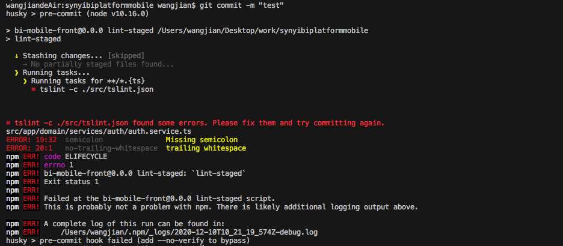
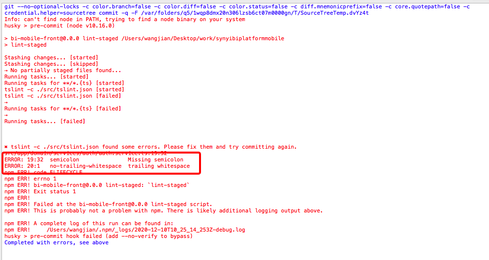

# 使用 Husky 和 lint-staged 实现 Git 提交前代码规范检查

## 背景说明
在团队协作开发中，人工确保代码符合规范存在疏漏风险。通过集成 Git Hook 工具，可在代码提交前自动触发规范检查，有效提升代码质量。本文将介绍如何使用 **husky** 和 **lint-staged** 实现这一流程。

---

## 工具简介
### 1. Husky
- **作用**：简化 Git Hook 的管理，支持自定义钩子脚本。
- **兼容性**：本文基于 husky@3.0.4，新版 v5+ 配置方式差异较大，建议参考[官方文档](https://typicode.github.io/husky)。

### 2. lint-staged
- **作用**：仅对 Git 暂存区（Staged）文件执行检查，避免全量扫描，提升效率。
- **原理**：通过文件匹配模式，对指定类型的文件运行格式化或检查命令。

---

## 实现步骤
### 1. 安装依赖
```bash
# 安装指定版本（兼容性更稳定）
npm install -D husky@3.0.4 lint-staged@9.2.5
```

### 2. 配置 package.json
#### 2.1 添加 scripts 命令
```json
"scripts": {
  "lint-staged": "lint-staged"
}
```

#### 2.2 注册 Git Hook
在 `package.json` 中配置 husky 的 `pre-commit` 钩子：
```json
"husky": {
  "hooks": {
    "pre-commit": "npm run lint-staged"
  }
}
```

#### 2.3 定义 lint-staged 规则
配置针对不同文件类型的检查命令：
```json
"lint-staged": {
  "*.ts": ["tslint -c ./src/tslint.json"]
}
```
- **匹配逻辑**：当提交 `.ts` 文件时，自动执行 `tslint` 检查。
- **参数传递**：匹配到的文件路径会自动附加到命令末尾，例如 `tslint -c ./src/tslint.json path/to/file.ts`。

---

## 执行流程说明
1. **暂存区过滤**：仅检查 `git add` 后的文件，未暂存的修改不会触发检查。
2. **错误处理**：若检查失败，所有错误信息会汇总输出，示例如下：
   - 命令行错误提示：
     
   - Sourcetree 错误提示：
     
3. **中断风险**：执行过程中若强制取消（如 `Ctrl+C`），可能导致代码丢失。建议通过 `git reflog` 尝试恢复。

---

## 常见问题与解决方案
### 1. 暂存文件未触发检查
**原因**：`picomatch` 版本冲突（`micromatch` 依赖 v2.0.5，而 `fast-glob` 依赖 v2.2.2）。  
**解决步骤**：
```bash
# 1. 锁定 picomatch 版本
npm install -D picomatch@2.0.5

# 2. 清除异常依赖
rm -rf node_modules package-lock.json

# 3. 重新安装依赖
npm install
```

### 2. 其他注意事项
- **检查范围**：确保 `tslint.json` 配置文件路径正确。
- **工具更新**：若升级到 husky v5+，需改用 `.husky` 目录管理钩子脚本。
- **替代方案**：推荐逐步迁移至 ESLint（TSLint 已停止维护）。

---

## 结语
通过自动化代码检查，可显著降低人工审查成本。若遇到未覆盖的问题，建议查阅 [husky 官方文档](https://github.com/typicode/husky) 或团队内部分享讨论。