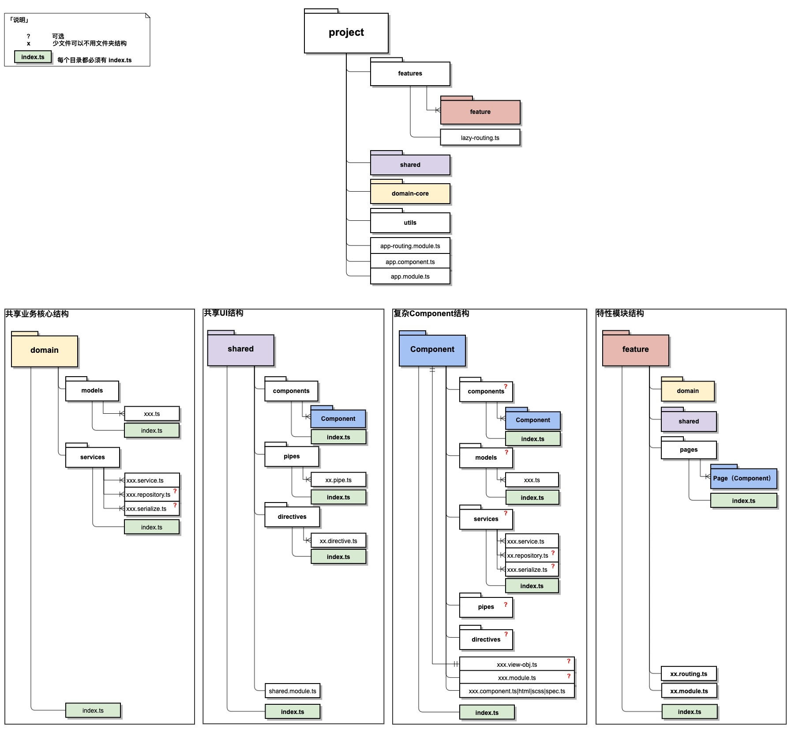
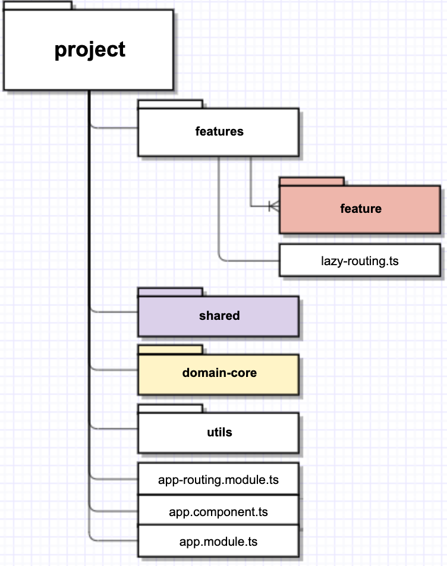
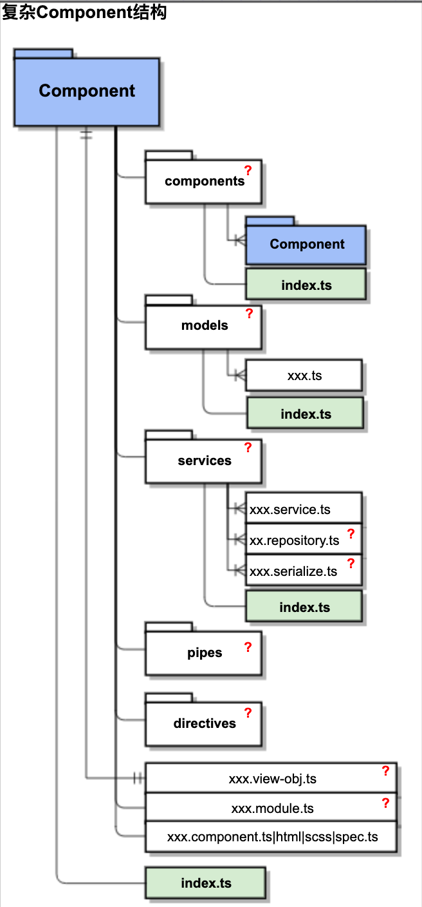

# 一. 总体项目结构

# 二.  规范说明

## 2.0. 约定

每个目录都必须有 index.ts

架构中出现的？代表在较少文件的情况下，可以摒弃文件夹的组织方式

Repository 与 Serialize 文件

Repository 何时使用：

- 存在 API 重复调用的问题
- service 聚合多个 API 的问题
- 调用划分不清晰

Service+Repository 怎么使用:

- service 作为业务的缓冲层，在 repository 里与数据源如 API 沟通，存取更新数据完成持久化
- repository 里 数据原始数据经过 normalize 变成期望数据，期望的数据经过 deserialize 变成实体模型

其它:

- 建议数据的 Normalize 操作和 Serialize 操作都在 Repository 里完成，如果 Serialize 过程复杂度较高，建议新建 Serialize 文件处理

| 名词       | 释义                                                  | 示例                                                                                                                  | 备注                                                                                                 |
| :--------- | :---------------------------------------------------- | :-------------------------------------------------------------------------------------------------------------------- | :--------------------------------------------------------------------------------------------------- |
| Repository | 处理数据源，例如 HTTP API，LocalStorage，IndexedDB 等 | http.get('api/user')                                                                                                  |                                                                                                      |
| Normalize  | 数据的标准化或者格式化操作                            | API 返回结果: user: {id: 1, displayName: 'xxx', birthday: '2009-12-10'} 标准化为: user: {id: 1, name: 'xxx', age: 11} | 1.JSON 数据 normalize 后返回的还是 JSON 数据;2.若数据源格式与期望的格式一致，可以不需要 Normalize    |
| Serialize  | 数据与业务实体的转化，比如 JSON <=> Model             | deserialize(IUserDTO): User serialize(User): IUserDTO                                                                 | 1.deserialize 传入  JSON 格式数据，返回值是业务模型 2.serialize 传入业务模型，返回值是 JSON 格式数据 |

## 2.1. 项目架构规范

### utils/

- 说明： 基础 functions，工具集等
- 备注： 禁止依赖外部内容

### domain-core/

- 说明： 项目的业务核心功能+基础建设
- 备注：
  - 仅可依赖 Utils
  - 存放 通用服务，例如：用户消息、Log、埋点、权限、登录、网络
  - 存放 项目业务核心，例如：用户模型、核心概念模型及相关服务

### shared/

- 说明： 项目的共享 UI、共享 Pipe、共享 Directive
- 备注： 仅可依赖 Utils、 DomainCore

### features/

- 说明： 业务特性模块
- 备注：
  - feature 内可依赖 Utils、 DomainCore 和 Shared
  - feature 与 feature 之间不存在相互依赖

### lazy-routing.ts

- 说明： 特性模块懒加载注册文件
- 备注： 可选

## 2.2. domain - 共享业务核心架构规范

### models/

- 说明： 项目核心业务模型
- 备注：
  - 仅可依赖 utils/ 和 models/model 文件
  - 禁止访问 services/ 内容

### services/

- 说明： 项目核心业务 service
- 备注：
  - 仅可依赖 utils/ 和 models/model 文件
  - repositories 和 serialize 文件非必须，视业务复杂度而定

### index.ts

- 说明： 对外 API
- 备注： 导出必要的 Model、Service 类

## 2.3. shared - 共享 UI 架构规范

- **仅可依赖 Utils、 DomainCore**

### components/

- 说明： 业务中共享的组件
- 备注： 可以是纯组件(如 UI 组件，也可以是带 service 的业务组件(参考 2.4. Component 架构规范

### pipes/

- 说明： 业务中共享的 pipe

### directives/

- 说明： 业务中共享的 directive

### shared.module.ts

- 说明： 共享 Module
- 备注：
  - 包含基础 module 声明如 Angular 的 CommonModule
  - 包含基础依赖 Module 的声明如 NgZorroAntdModule

### index.ts

- 说明： 对外 API
- 备注： 导出 share.module.ts 的 SharedModule

## 2.4. component 架构规范

- **仅可依赖 Utils、 DomainCore、Shared**
  

### components/

- 说明： 只在当前`Component`内嵌其它组件
- 备注： 可选/架构同 Component 架构

### models/

- 说明： 只在当前`Component`涉及的业务模型
- 备注： 可选

### services/

- 说明： 只在当前`Component`使用的服务
- 备注： 可选/repositories 和 serialize 文件非必须，视业务复杂度而定

### directives/

- 说明： 只在当前`Component`使用的 directive 类
- 备注： 可选

### pipes/

- 说明： 只在当前`Component`使用的 pipes 类
- 备注： 可选

### xxx.view-obj.ts

- 说明： 当前`Component`对应的 ViewObject
- 备注：
  - 可选
  - component 与 ViewObject 一对一的关系
  - 属性方法等无法界定其所属职责范围，这种情况可以放置在 ViewModel 上

### xx.module.ts

- 说明： NgModule 文件，旨在封装 component
- 备注：
  - 可选
  - 设计上推荐 一个完整颗粒度 component 一个 NgModule
  - 声明当前 Component 以及子非声明过的 Component，Directive，Pipes

### index.ts

- 说明： 对外 API
- 备注：若存在 xx.module.ts 则导出其 NgModule，若无则导出当前 Component

## 2.5. feature 架构规范

- **仅可依赖 Utils、 DomainCore、Shared**
  

### domain/

- 说明： 当前特性模块共享的业务核心
- 备注：
  - 文件内容参考上述 2.2. 共享业务核心架构规范
  - 关注点在当前 Feature 领域

### shared/

- 说明： 当前特性模块共享的 UI
- 备注：
  - 文件内容参考上述 2.3. 共享 UI 架构规范
  - 关注点在当前 Feature 领域

### pages/

- 说明： 特性模块下页面
- 备注：
  - 页面结构同参考上述 2.4. Component 架构规范
  - 强制页面目录 平级组织（若存在父子结构关系，利用路由实现）
  - 强制每个页面都 导出 NgModule

### xx.routing.ts

- 说明： 特性模块路由模块
- 备注： 关注自身以及页面的路由组织方式

### xx.module.ts

- 说明： NgModule 文件
- 备注：

### index.ts

- 说明： 对外 API
- 备注：
  - 导出 xx.module.ts 内 NgModule
  - 该 Module 仅供 app-routing.module.ts 或者 app.module.ts 使用
