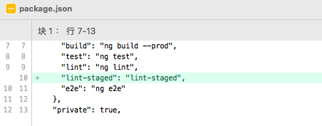
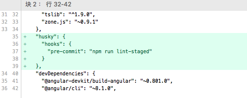
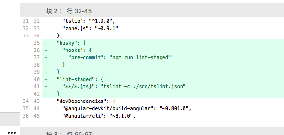
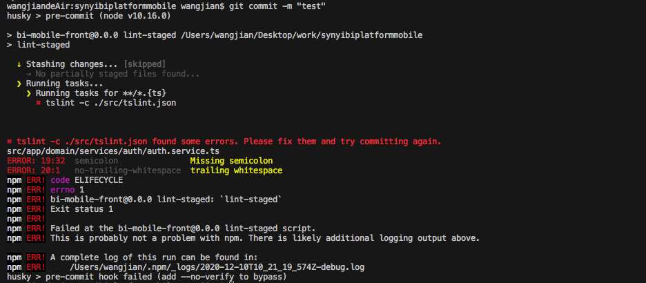
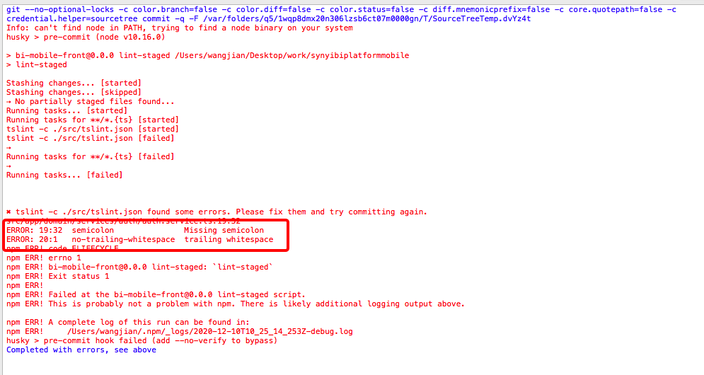

了解到部分同学在部分项目的开发过程中依然靠开发者人工来确保不会提交不符合lint规范的代码，而公司目前也没有这方面的科普文，故本着能水一篇是一篇的原则，安利一下用于在代码commit之前自动检测即将提交的代码是否符合lint规范的工具。
<!-- more -->

## 安装 husky
`husky`是可以让开发者同学能更方便使用`git hooks`的工具。[点我了解git hooks](https://www.git-scm.com/book/zh/v2/%E8%87%AA%E5%AE%9A%E4%B9%89-Git-Git-%E9%92%A9%E5%AD%90)，[点我了解husky](https://github.com/typicode/husky#readme)
```bash
# 个人目前在使用的是如下版本，新版v5有较大改版，有兴趣的同学可以研究一下最新版
npm i -D husky@3.0.4
```

## 安装 lint-staged
`lint-staged`是对`git`暂存区文件————仅针对暂存区，而非整个项目————执行自定义命令的工具。[点我了解lint-staged](https://github.com/okonet/lint-staged)
```bash
# 个人目前在使用的是如下版本
npm i -D lint-staged@9.2.5
```

## 在 package.json 中添加配置
1. 首先在`package.json`的`scripts`字段下添加新字段`lint-staged`: 

2. 在`package.json`添加`husky`配置，该配置是自定义的，与`scripts`、`devDependencies`等字段平级：

3. 在`package.json`添加`lint-staged`配置，该配置是自定义的，与`scripts`、`devDependencies`等字段平级：

<font color="red">此配置与之前提到的`scripts`下的`lint-staged`的区别：</font>
- <font color="red">`scripts`下的是指新增了一条名为`lint-staged`的脚本命令，开发者可以使用`npm run lint-staged`执行该脚本</font>
- <font color="red">此处的`lint-staged`指的是执行`npm run lint-staged`时会使用到的配置</font>

<b>简单解释一下上述配置的意思</b>：
- 新增一个`scripts`：`lint-staged`
- 注册一个名为`pre-commit`的hooks，该hooks触发时将执行上述添加的`lint-staged`脚本命令，即：在开发者执行commit时，会自动先执行`npm run lint-staged`
- 添加触发`pre-commit`而执行`npm run lint-staged`时所需的具体配置，即：匹配到`.ts`文件则执行`tslint -c ./src/tslint.json`，匹配到的文件的文件名会作为参数传给`tslint -c ./src/tslint.json`，比如匹配到了`/path/a.ts`文件，将执行`tslint -c ./src/tslint.json /path/a.ts`，如果执行过程中发现了不符合lint规范的代码，会收集所有的错误，并在所有文件都执行完以后一起抛出，开发者可以根据错误信息找到需要修改的文件及错误所在的行列，考虑到刚接触的同学可能不太容易找到错误信息的具体位置，故列出错误信息参考图：

  使用命令行：
  
  使用sourcetree:
  
## 一些问题

- 如文章开头所述，`lint-staged`是针对暂存区的，即如果你更改了10个文件，但你只添加了4个到暂存区，则只会在这4个文件找符合条件的文件执行对应的命令
- 按照如上操作做完之后，在commit时有可能出现明明暂存区有`.ts`文件，但却不对这些文件执行lint的情况，
  原因如下：
  1. `lint-staged`依赖了`micromatch`和`globby`，`globby`依赖了`fast-glob`
  2. `micromatch`依赖了`picomatch@2.0.5`，`fast-glob`则依赖了`picomatch@2.2.2`
  3. npm安装`picomatch`时，取了v2.2.2，但该版本的行为与`micromatch`所依赖的v2.0.5有出入，故而导致前述问题


  解决办法如下：
  1. 丢弃`package-lock.json`的更改
  2. 在`package.json`的中的`devDependencies`字段下添加配置："picomatch": "2.0.5"
  3. 执行`npm install`
  4. 查看`package-lock.json`中的`picomatch`的版本信息，正常来讲应该是2.0.5，此时可将第2步中添加的依赖配置删除

- <font color="red">正在执行`pre-commit`时，不要取消，即：如果你使用的是命令行，此时此刻不要按`ctrl + c`；如果你使用的是sourcetree等工具，则不要点取消。如果取消了有可能出现不可预知的问题，比如更改的代码全部丢失，我不确定这种情况下是否可以通过`git fsck`找回丢失的代码</font>

- 如果遇到其他问题可以在群里抛出来，大家一起研究一下
- 我水完了