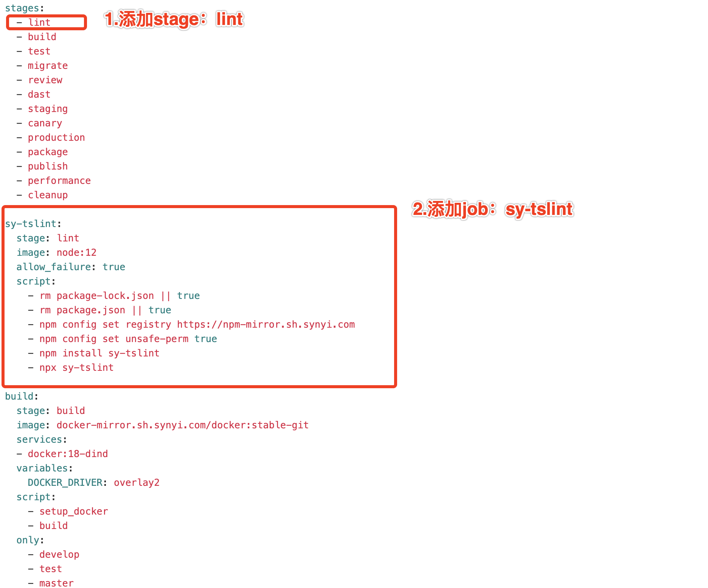

> 基本环境 Node V12

# 一.安装 sy-tslint

安装：

`npm i sy-tslint@0.0.1-dev.1366913 --save --registry https://npm-mirror.sh.synyi.com/`

项目集成：

修改项目根目录下的 tslint.json 文件，全选内容，替换为：

{
"extends": "sy-tslint",
"rules": {}
}

执行检查：

- npx sy-tslint

自动修复：

- npx sy-tslint-fix

# 二.集成 CI/CD

修改项目的.gitlab-ci.yml 文件，新添加一个 lint stage 和 sy-tslint job,配置如下:

```
stages:

- lint

sy-tslint:
stage: lint
image: node:12
allow_failure: true
script: - rm package-lock.json || true - rm package.json || true - npm config set registry https://npm-mirror.sh.synyi.com - npm config set unsafe-perm true - npm install sy-tslint - npx sy-tslint
```

例子：
